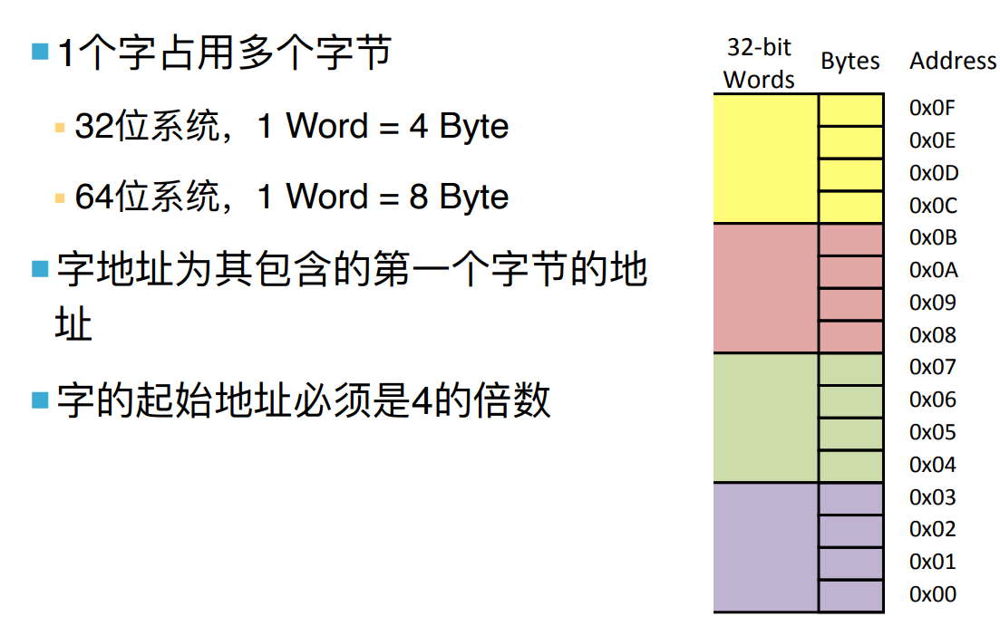
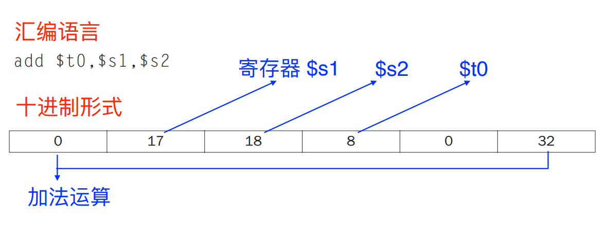

# Sildes4：机器语言 p1

# 指令的基本概念

## 计算机语言的三个层次

计算机语言的三个层次是什么？  
高级语言-汇编语言-机器语言

​​

## 指令和指令系统

**指令**：是计算机运⾏的最⼩的功能单元,是指挥计算机硬件运 ⾏的命令,是由多个⼆进制位组成的位串

⼀台计算机提供的全部指令构成该计算机的**指令系统**

## 常见的指令系统有哪些

常见的指令系统有哪些？​

## 指令系统的分类

指令系统可以分哪两类？  
CISC：复杂指令系统计算机；RISC：精简指令系统计算机  
x86是前者，ARM和MIPS是后者

# MIPS指令系统

Microprocessor without interlocked piped stages——⽆内部互锁流⽔级的微处理器RISC芯⽚

（当然，和MIPS，Million Instructions Per Second不一样）

​

## 一些数据单位

* 1 Byte=** 8 bits**
* word 是**32bits或者64bits**​

## MIPS指令的类型和结构

MIPS指令都为**单字指令**​，意味着指令⻓度=机器字⻓，其结构如下：​​左边是MSB，右边是LSB

## MIPS CPU

MIPS CPU里有什么？  
32个通用寄存此，每个寄存器里有32位​

## MIPS 寄存器

MIPS寄存器有（按照寄存器数排序）：

* ​`$zero`​ **0寄存器**
* ​`$v0-$v1`​ values for results and expression evaluation
* ​`$a0-$a3 ​`​arguments
* ​`$t0-$t7`​temporaries
* ​`$s0-$s7`​saved
* ​`$t8-$t9`​more temporaries
* ​`$gp`​global pointer
* ​`$sp`​stack pointer
* ​`$fp`​frame pointer
* ​`$fp`​return address

## 数据在储存器中的存放

数据在储存器中如何存放？  
首先，我们将储存器视作一个很长的字节数组；  
其次，一个字占用很多字节（32位系统，1 Word = 4 Byte），字地址为其包含的第⼀个字节的地 址  
有大端编址和小端编址的说法，在MIPS中采取前者，意味着数据从地址大的地方往地址小的地方储存

​

​

## 大端编址vs小端编制

MIPS指令集从小的地址开始，即小地址做MSB，X86与之正相反，这被称为**小端编址**

## 32位内存最大字容量

最大容量为：**2**​**^32^**​**Bytes/ 2**​**^30^**​**Words**(32位计算机中)

## MIPS操作数

MIPS中有哪三种操作数？  
寄存器操作数，储存器操作数，立即数操作数

### 寄存器操作数

​​

### 储存器操作数

数据传输指令：lw，sw

​​

——为了获得更⾼的性能和节约功耗，编译器必须⾼效率地利⽤寄存 器

### 操作常数的指令

```mipsasm
lw $t0, AddrConstant4($s1) # $t0 = constant 4 
add $s3,$s3,$t0 # $s3 = $s3 + $t0 ($t0 == 4)
addi $s3,$s3,4 #$s3=s3+4
```

## 计算机中的指令的表示

* **指令字**:完整的⼀条指令的⼆进制表示
* **指令字⻓**:指令字中⼆进制代码的位数；MIPS中所有指令都是32位长
* **指令格式**:指令字中操作码和操作数地址的⼆进制位的分 配⽅案
* **操作码**:指明本条指令的操作功能,每条指令有⼀个确定的 操作码
* **操作数地址**:说明操作数存放的地址,有时是操作数本身

​​

比如一个add指令的映射：

​​

二进制形式如下：

​​

## MIPS指令格式

​​op:指令的基本操作，通常称为操作码  
s**:第一个源操作数寄存器**  
t:第二个源操作数寄存器  
rd:**用于存放操作结果的目的寄存器**  
shamt:位移量，在移位指令中使用  
funct:功能码，用于指明op字段中操作的特定变式

但是对于所有指令，使用上述统一格式，存在问题，比如两个寄存器⼀个常数，常数被限定在2^5^​之内

我们有折中方案，定义三个不同的指令类型，R型，I型，J型

## MIPS指令类型

MIPS三种指令类型是什么？格式大概是什么样子？​
