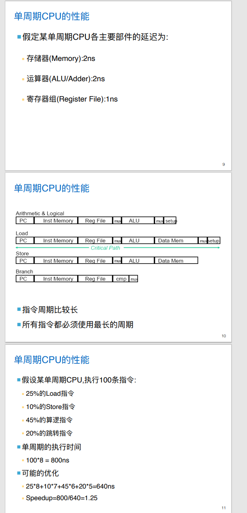
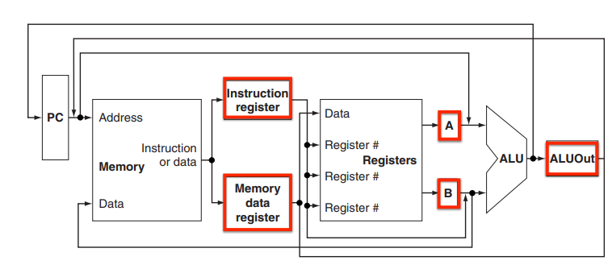
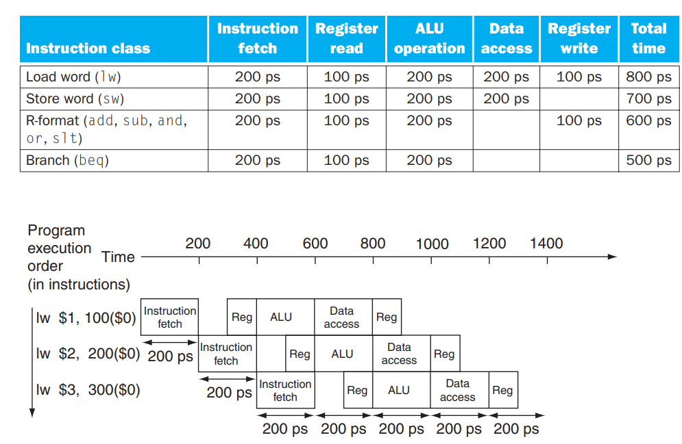
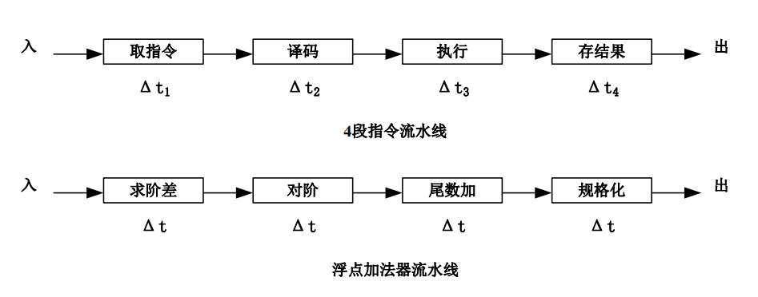
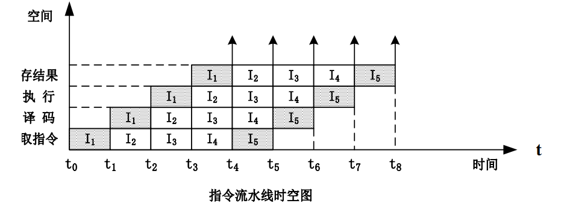
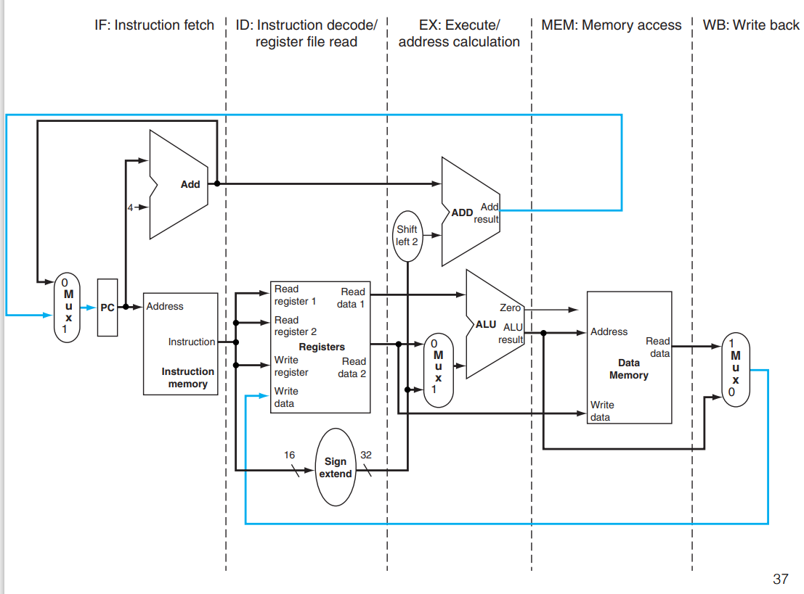
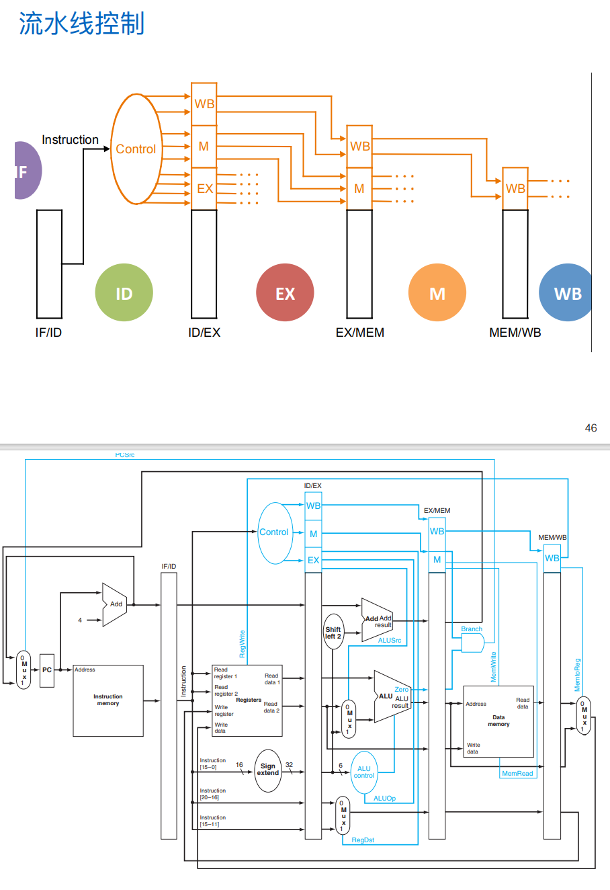
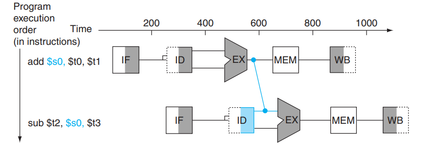
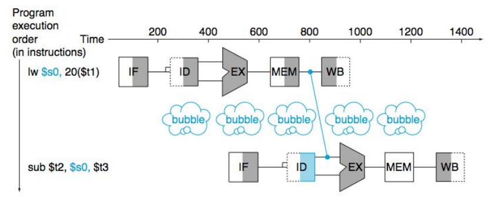

# Slides10：processor

# 单周期CPU

## 单周期CPU

* 计算机一条指令的执行时间被称为**指令周期**
* 一个CPU时钟时间被称为**CPU周期**
* 执行每条指令平均使用的CPU周期个数被称为**CPI**
* 全部指令都选用一个CPU周期完成的系统被称为**单周期CPU**

## 执行指令的基本步骤

执行指令的基本步骤是什么？  
取指(IF)-读取寄存器(ID/RF)-进行指令规定的运算或者计算地址(EXE)-读写数据存储器(MEM)-将结果写入目的计算器(WB)

## 单周期CPU的控制信号

在单周期CPU中，每条指令占用**一个**时钟周期；控制信号需要控制**ALU运算，寄存器储存器写入，MUX**

## 单周期CPU的特点

 单周期CPU的优缺点有什么？  
优点：每条指令占用一个时钟周期，逻辑设计简单，时钟设计也简单  
缺点：各组成部件的利用率不高，各部件大部分时间在等待，时钟周期应满足执行时间最长指令的要求-Load指令  
CPI=**1**

性能计算：

​​

# 多周期CPU

## 多周期CPU的数据通路

多周期CPU的数据通路是什么样子的？  
​  
即加入三组寄存器

# 流水线

## 流水线的概念

什么是计算机中的流水线？  
计算机中的流⽔线是把⼀个重复的过程分解为若⼲个 ⼦ 过程,每个⼦过程与其他⼦过程并⾏进⾏。由于这 种⼯作 ⽅式与⼯⼚中的⽣产流⽔线⼗分相似,因此称为流⽔线技 术

## 流水线的好处

流水线的好处-提⾼处理机内部的并⾏性：

* **空间并⾏性**,即在⼀个处理机内设置多个独⽴的操作部件,并且使 这些部件并⾏⼯作
* **时间并⾏性**,就是采⽤流⽔线技术。流⽔线技术是⼀种⾮常经 济、对提⾼计算机的运算速度⾮常有效的技术。采⽤流⽔线技 术只需增加少量硬件就能把计算机的运算速度提⾼⼏倍,成为计 算机中普遍使⽤的⼀种并⾏处理技术

## 流水线的广泛应用

计算机的各个部分都采用流水线技术：  

* **指令流水线**：指令的执行过程采用流水线
* **操作部件流水线**：运算器中的操作部件，如浮点加法器、浮点乘法器等可以采用流水线
* **宏流水线**：多个计算机之间，通过存储器连接，可以采用流水线

## 流水线的执行过程

​​

## 流水线的表示方法

流水线的每一个阶段完成一条指令的**一部分**，不同阶段并行完成不同指令的不同部分。  
流水线中的每一个阶段称为一个**流水阶段**。一个流水阶段与另一个流水阶段相连接形成流水线。  
指令从流水线的一端进入，经过流水线的处理，从另一端流出。目前大部分处理器的指令流水线在**3-12**段之间。  
流水线常用的两种表示方法：

* 流水线**连接图**表示法，各个流水段顺序连接在一起  
  ​​
* 流水线**时空图**表示法，直观描述流水线工作过程  
  ​​

## 流水线的特点

* 在流⽔线中必须是**连续的任务**，只有不断的提供任务才能充分发挥流⽔ 线的效率
* 把一个任务（一条指令或一个操作）分解为**几个有联系的子任务**，每个子任务由一个专门的功能部件来实现。
* 流水线每一个功能段部件后面都要有一个**缓冲寄存器，或称为锁存器**，其作用是保存本流水段的结果。
* 流⽔线中各段的时间应该**尽量相等**，否则将会引起“堵塞”和“断流”的现
* 流⽔线需要有**装⼊时间和排空时间**，只有当流⽔线完全充满时，才能充 分发挥效率

## 流水线的原理-1

流水线的时钟周期如何计算？  
设过程段S所需的时间为$t_i$,缓冲寄存器的延时为$t_l$，线性流水线的时钟周期定义为$t=max(t_i)+t_l$；处理频率$f=1/t$

## 流水线的原理-2

流水线的加速比如何分析？  
⼀个具有k级过程段的流⽔线处理n个任务需要的时钟周期 数$T_k ＝k＋(n-1)$；非流水线硬件处理需要的时钟周期数为$T_L=nk$；k级流水线的加速比$C_k=T_L/T_k=nk/(k+n-1)$

## MIPS流水线的实现

请问指令执行的五个步骤占用的资源分别是？  
IF：IM,PC  
ID/RF：寄存器组，控制信号生成部件  
EXE：ALU  
MEN：DM  
WB：寄存器组  
在示意图中显示如下：  
​​

## 流水线控制

在流水线上，每个部件执行的不是同一条指令，这时我们应该怎么办？  
对策是把控制信号也和数据⼀样流动起来  
​​

# 流水线冒险

## 流水线冒险的种类

* **结构冒险**：是指令在重叠执⾏的过程中,硬件资源满⾜不了指令重叠执 ⾏的要求⽽产⽣的冒险
* **数据冒险** ：是指在同时重叠执⾏的⼏条指令中,⼀条指令依赖于前⾯指 令执⾏结果数据,但是⼜得不到时发⽣的冒险
* **控制冒险** 决策依赖于⼀条指令的结果，⽽其正在执⾏中

## 结构冒险的例子及其解决方案

结构冒险的例子及其解决方案？  
如果只有一个存储器，执行第四条指令时，第一条指令和第四条指令将同时访问存储器，就会发生结构冒险  
解决方案：数据通路中的每⼀个功能单元都只能在⼀个流⽔级中使⽤

## 数据冒险的例子及其解决方案

数据冒险的例子（两种）及其解决方案？  
`add $s0, $t0, $t1\\ sub $t2, $s0, $t3`​，第一个加法指令执行到第五步的时候才能返回结果  
解决⽅案：前推（或旁路）  
​  
另外一种数据冒险是取数-使⽤型数据冒险（装载指令要取的数还没取来时其他 指令就需要使⽤），这一情况的解决方案有流水线阻塞，或者重新安排代码避免阻塞：  
​​

## 控制冒险的例子及其解决方案

控制冒险的例子及其解决方案？  
beq，然后后面接着任意运算；  
解决方案这里只提了阻塞
