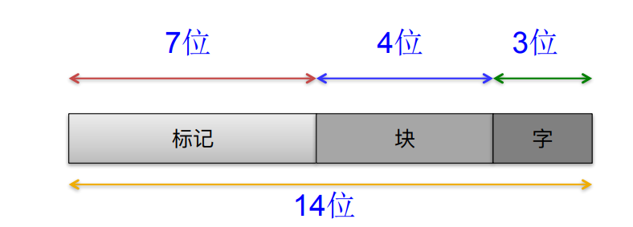
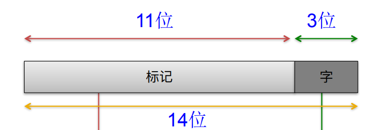
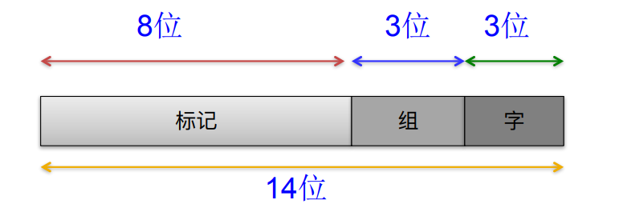
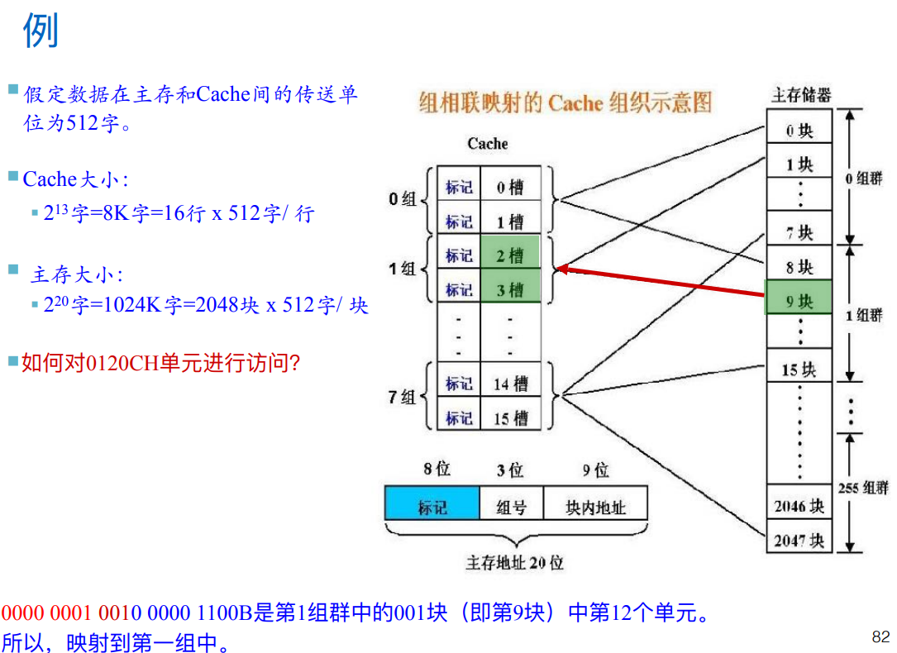

# Slides11：存储器层次结构

# 层次储存器系统概述

## 储存器的作用

储存器的作用是：计算机中⽤来存放**程序和数据**的部件,是Von Neumann 结构计算机的重要组成

## 储存器的分类-1

* 随机存取存储器Random Access Memory (RAM)：每个单元读写时间**⼀样**，且与各单元所在位置⽆关。如：**内存**
* 顺序存取存储器Sequential Access Memory (SAM)：数据按顺序从存储载体的始端读出或写⼊，因⽽存取时间的⻓短与信息所在位置有关。例如：**磁带**。
* 直接存取存储器Direct Access Memory(DAM)：直接定位到要读写的数据块，在读写某个数据块时按顺序进⾏。例如：**磁盘**。
* 相联存储器Associate Memory/Content Addressed Memory (CAM)：按内容检索到存储位置进⾏读写。例如：**快表**。

注：快表就是存放在高速缓冲存储器的部分页表。

## 储存器的分类-2

* 按存储介质：

  *  读写存储器（Read / Write Memory)：**可读可写**
  * 只读存储器（Read Only Memory)：**只能读不能写**
* 按信息的可更改性分类 ：

  * **半导体**存储器：双极型，静态MOS型，动态MOS型
  * **磁表⾯**存储器：磁盘（Disk）、磁带 （Tape）
  * **光**存储器：CD，CD-ROM，DVD

## 储存器的分类-3

* 非易失（不挥发）性存储器(Nonvolatile Memory) ，信息可⼀直保留，不需电源维持，如 ：**ROM、磁表⾯存储器、光存储器**等
*  易失（挥发）性存储器(Volatile Memory)  ，电源关闭时信息⾃动丢失。如：**RAM、Cache**等

## 储存器的分类-4

* 寄存器 用**触发器**实现
* cache 用**SRAM**实现
* 内储存器 用**DRAM**实现
* 外储存器 用**磁表面或者光储存器**实现

资料补充，[SRAM](https://zh.wikipedia.org/wiki/%E9%9D%99%E6%80%81%E9%9A%8F%E6%9C%BA%E5%AD%98%E5%8F%96%E5%AD%98%E5%82%A8%E5%99%A8)，[DRAM](https://zh.wikipedia.org/wiki/%E5%8A%A8%E6%80%81%E9%9A%8F%E6%9C%BA%E5%AD%98%E5%8F%96%E5%AD%98%E5%82%A8%E5%99%A8)，[区别](https://zhuanlan.zhihu.com/p/347151409)

## 储存器对性能的影响

某台计算机，主频 = 1GHz (机器周期为1 ns) ；CPI = 1.1 50%；算逻指令, 30% 存取指令, 20% 控制指令；再假定其中10% 的存取指令会缺失,需要50个周期的延迟。(当前主 存的典型值)，请你计算CPI？  
CPI=理想CPI+每条指令的平均延迟 =1.1 +(0.30x0.10x50)  =1.1cycle+ 1.5cycle =2.6CPI

## 局部性原理

局部性原理表现在？  
在一小段时间内，最近被访问过的程序和数据很可能再次被访问  
在空间上，这些被访问的程序和数据往往集中在一小片存储区  
在访问顺序上，指令顺序执行比转移执行的可能性大(大约5:1)

## 现代计算机的层次储存系统

* 利用程序的**局部性原理**
* ⼀致性原则:**​ 处在不同层次存储器中的同⼀个信息应保持相同的值**
* 包含性原则: **处在内层的信息⼀定被包含在其外层的存储器中, 反之则不成⽴**

## 高速缓冲储存器

* 定义：设置于**主存和CPU之间**的存储器,⽤⾼速的静态存储器实现,缓存了CPU频繁访问的信息
* 特点：

  * **高速**：与CPU的运⾏速度基本匹配
  * **透明**：完全硬件管理,对程序员透明
* 功能：**解决CPU和主存之间的速度不匹配问题**
* 层次：现在的CPU有**3**层cache

## 高速缓冲储存器工作原理

* CPU与Cache之间的数据传送是 以**字**为单位
* 主存与Cache之间的数据传送是 以**块**为单位

## 高速缓冲储存器的基本参数

* **块(Block)**:数据交换的最⼩单位
* **命中(Hit)**:在较⾼层次中发现要访问的内容 

  * **命中率(Hit Rate)**:命中次数/访问次数
  * **命中时间**:访问在较⾼层次中数据的时间
* **失效(Miss)**:需要在较低层次中访问块 

  * **失效率(Miss Rate)**:1-命中率
  * **失效损失(Miss Penalty)**:替换较⾼层次数据块的时间+将该块交付给处理器的时间

## 数据块及其拆分

* **block size**：块中bits的数目
* block ID：**adress	bits	- offset bits**
* offset：**log2(block size)**

## cache映射-定义

什么是cache的映射功能？  
解决把访问的局部主存区域取到Cache中时，该放到Cache的何处？的问题

## cache映射-方法

如何进行cache映射？  
把主存划分成⼤⼩相等的主存块（Block）；Cache中存放⼀个主存块的对应单位称为槽（Slot）或⾏（line）或块 （Block）

## cache映射-分类

将主存块和Cache⾏按照以下三种⽅式进⾏映射 ：

* **直接(Direct)**：每个主存块映射到Cache的固定⾏中
* **全相联(Full Associate)**：每个主存块映射到Cache的任意⾏中
* **组相联(Set Associate)**：每个主存块映射到Cache的固定组中的任意⼀⾏中

### 直接映射

什么是cache映射中的直接映射？  
⼀个主存块只能拷⻉到cache的⼀个特定⾏位置上去，具体而言计算公式为：index(Block ID)=Block ID mod S；适合⼤容量cache，更多的⾏数可减⼩冲突的机会

#### 直接映射-eg-1

存储器$2^{14}$字组成，cache有16行，每个块/行由八个字组成：储存器地址位数为**14**，储存器共划分为**$2^{14}/2^3=2^{11}214/23=211$**块

​

​

#### 直接映射-eg-2

* 存储器$2^{14}$字组成，cache有16行，每个块/行由八个字组成
* 主存地址：d=11011001100011
* 在主存中的块号：**$j=d/{2^3}=j=d/23=$**​**11011001100**​（求商）
* 映射到cache中的行号：**$i=j|2^4=i=j∣24=$**​**$i=j|2^4=i=j∣24=$**​**1100**​（取余）
* tag：**1101100**

#### 直接映射-eg-3

假定数据在主存和Cache间的传送单位为512字，Cache大小：$2^{13}$字=8K字=16行x512字/行，主存大小：$2^{20}$字=1024K字=2048块X512字/块，如何对0220CH单元进行访问？  
对于地址的拆解为：7 tag+4 index+9 offset  
将该单元变化为2进制：0000 001   0 001   0 0000 1100B 是第1块群中的0001块（即第17块）中第12个单元！

### cache中的位数

在32位字节地址，直接映射cache，cache大小为$2^n$块，块大小为$2^m$字，标记域⼤⼩为 **32-(m+n+2)**，cache总位数为 **2**​**^n^**​**×(块⼤⼩+标记域⼤⼩+有效位⼤⼩)**

【注：这个card非常不成熟，标记域是什么？】

https://blog.csdn.net/vavid317/article/details/110946947

### cache中的位数-例子

直接映射cache，32KB的数据，块⼤⼩为8 字，地址为32位，那么该cache总共需要的位数是？  
$2^{10}×(4×32+(32-10-2-2)+1)=2^{10}×147$

【注：这个card非常不成熟，标记域是什么？】

### 全相联映射

全相联映射的基本思想是什么？  
⼀个主存块可以装⼊cache任意⼀⾏；冲突概率⼩，Cache的利⽤率⾼，但比较电路成本高，适用于小容量的cache

#### 全相联映射-eg1

存储器$2^{14}$字组成,Cache有16⾏,每个块、⾏由8个字组成，请问储存器一共划分为多少块？  
$2^{14}/2^{3}=2^{11}$

​​

#### 全相联映射-eg2

cache映射方式为全相联映射，假定数据在主存和Cache间的传送单位为512（2^9^）字。Cache大小：2^13^字=8K字=16行X512字/行，主存大小：2^20^字=1024K字=2048块×512字/块，如何对01E0CH单元进行访问？  
0000 0001 111   0 0000 1100B，是第15块中的第12个单元

### 组相联映射

组相关映射的基本思想是什么？  
全相联和直接相连的折衷⽅案，将cache分组，组间采⽤直接映射⽅式，组内采⽤全相联的映射⽅式

#### 组相联映射-eg1

* 存储器$2^{14}$字组成，Cache有16行，分为8组；每个块、行由8个字组成
* 存储器地址位数？**14位**
* 存储器共划分为多少块？$2^{14}/2^3$=**2^11**
* 组号，offset，tag分别是多少位：**3+3+8**

​​

#### 组相联映射-eg2

placeholder

​​

#### 组相联映射的描述方式

Cache分u组，组内容量v⾏，V=1,则为**直接相联映射方式**；U=1,则为**全相联映射方式**；V的取值一般比较小，一般是2的幂，称之为**V路组相联cache**

### 思考题

某计算机的Cache共有16行，采用2路组相连映射方式。每个主存块大小为32字节，按字节编址。主存129号单元所在主存块应转入到Cache组号是？  
5 offset+3 index（log2（16/2））+ other tag  
129=xxxx 100     0 0001，cache组号为（100）2=4

‍

‍
