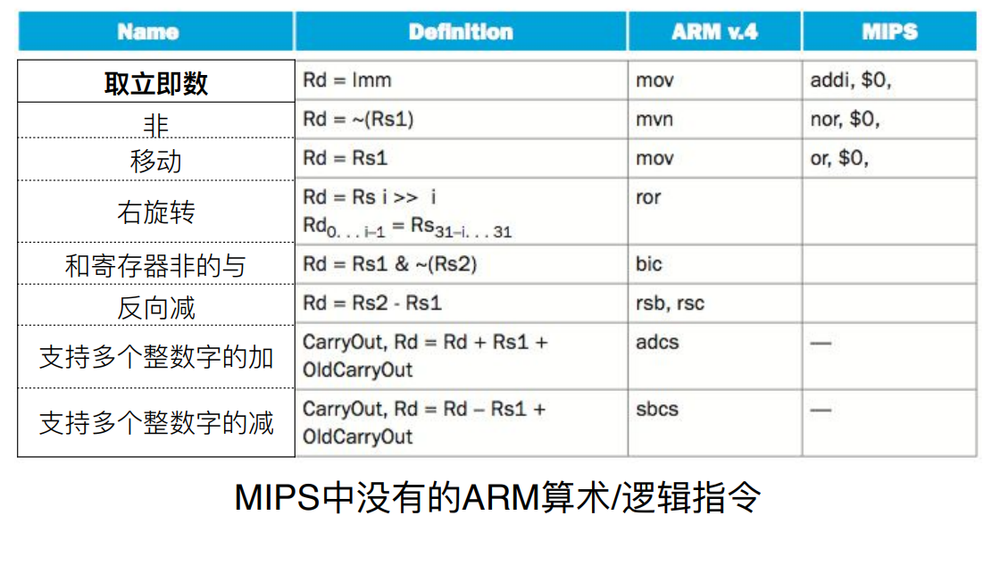
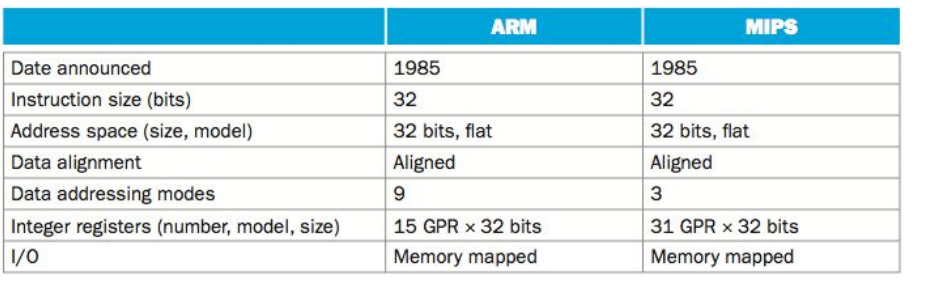
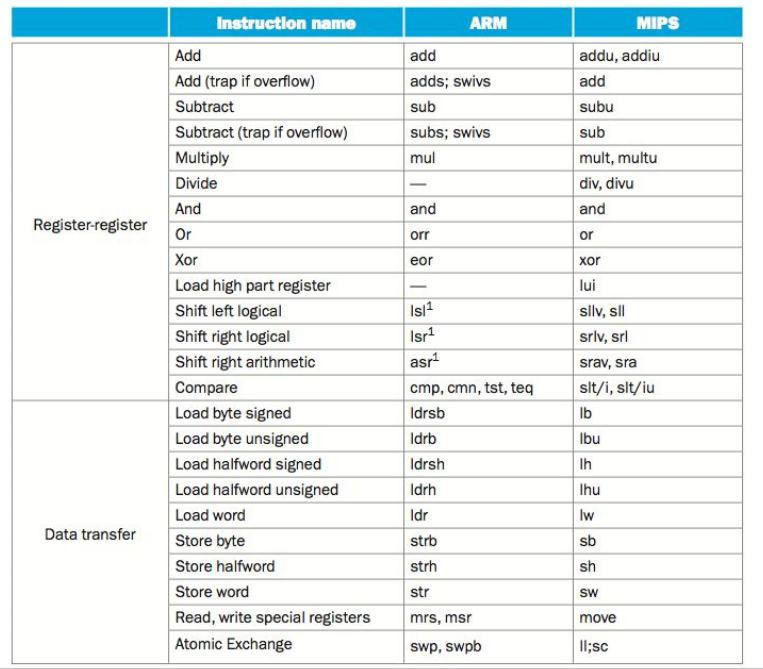
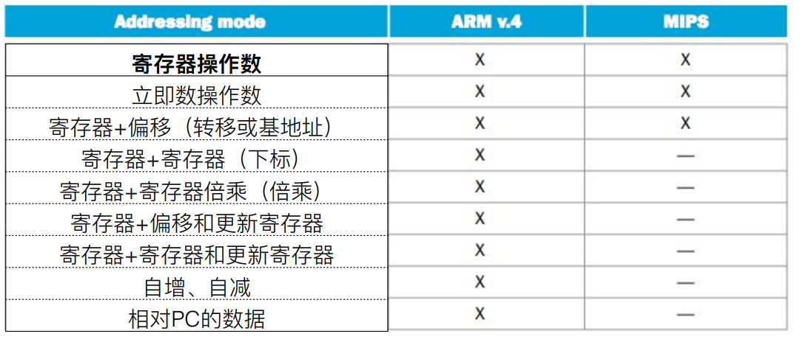
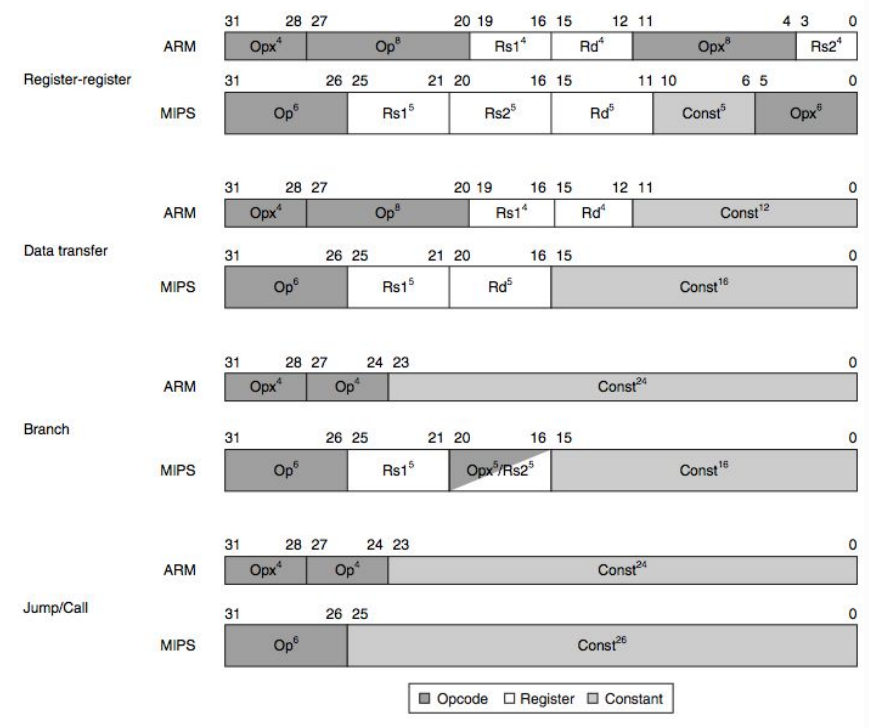

# Slides6：计算机指令实例

【note，这个有点难，看不懂。考虑先找一个视频看明白再制卡】

## ARM的特点

* MIPS中**没有**的ARM算术/逻辑指令
* **没有**专⻔的寄存器存储0
* 对操作数的移位并不限于**⽴即数**
* ARM还对**寄存器组**的操作提供了指令⽀持-块加载和块储存

​​

# ARM指令集

## 基本特征

采用32位**精简**指令集（RISC）处理器架构，其⼴泛地使⽤在许多**嵌⼊式系统设计**

与MIPS相比，有较少的寄存器和更多的寻址模式

​  

​​

​​

## ARM指令格式

​​

观察知，ARM指令集和MIPS指令集的主要区别是：

* 每条指令的 4 位条件执⾏字段 不同
* ARM拥有较==小==的寄存器字段

# X86指令集

## 基本特征

X86指令集的基本特征：是**复杂**指令集处理器架构，是目前世界上最流⾏的**台式机**体系结构。

## x86寄存器和数据选址模式

* 通用寄存器：有**8**个，用前缀E表示
* 算术和逻辑指令中的⼀个操作数必须**既是源操作数 ⼜是⽬的操作数**

## 三类基本指令

* Transfer'data'between'memory'and'register
* Perform'arithme?c'func?on'on'register'or'memory'data
* Transfer'control:'what'instruc?on'to'execute'next

‍
