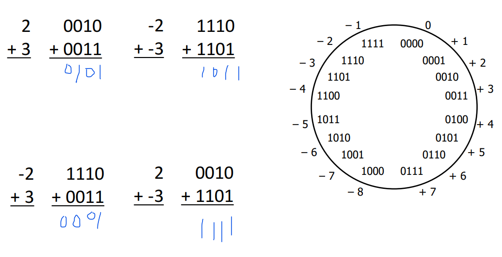
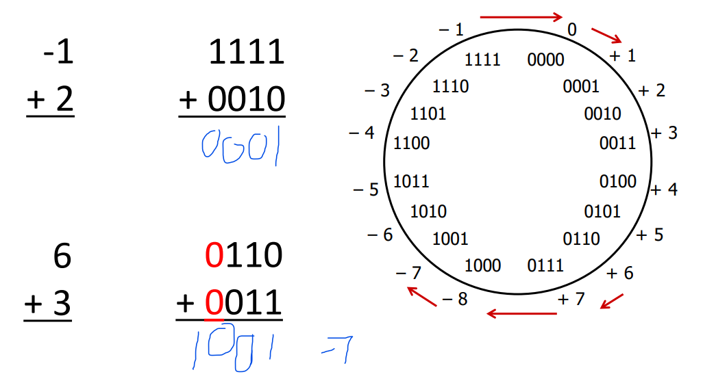
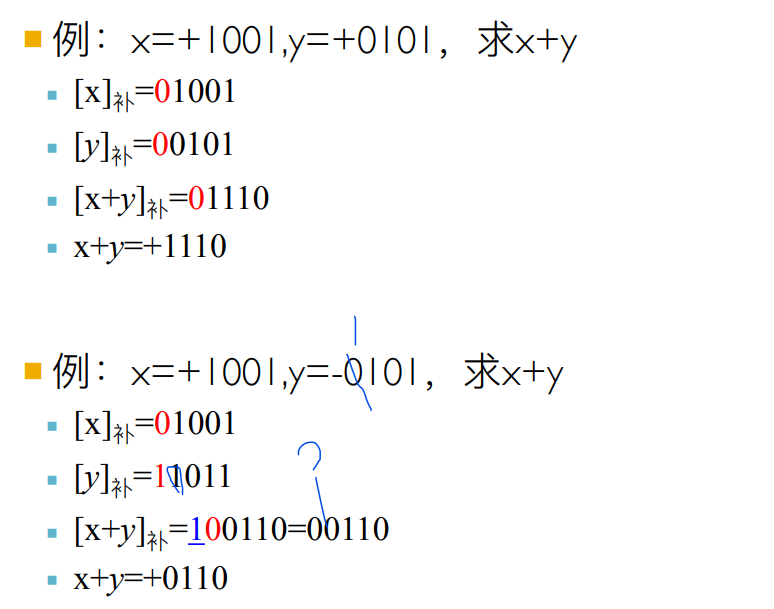
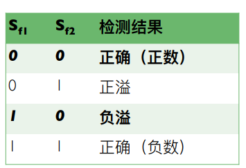
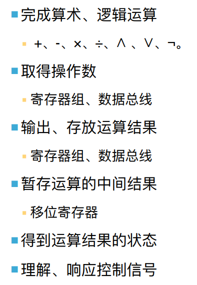
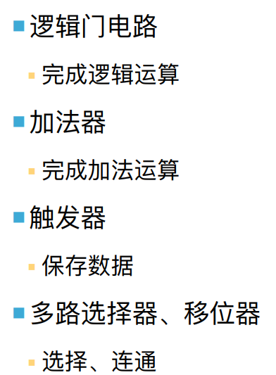
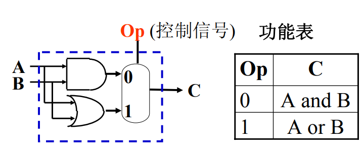
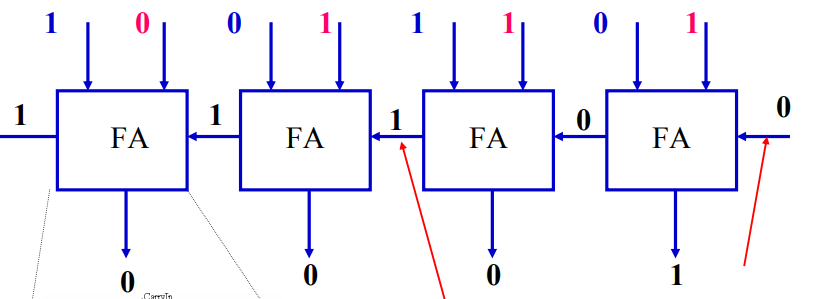
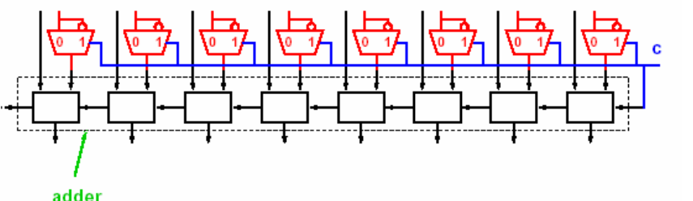

# Slides7:算数操作

# 数据表示

## 定点整数

整数编码的三种方式：

* 原码：符号位+**数的绝对值**​
* 反码：符号位+**[1]数值按位求反**
* 补码：反码的最低位+1

可以做这样的逻辑理解，原码就是很符合直觉的符号位+数值位->反码，对负数部分取反，进而便利正负加和的运算->补码：负数部分挪动一位，防止编码里有两个0浪费

注：补码的计算方式可以理解为无符号位，高位为负，其他位为正

## 例题

我们列出一些二进制，请你指出其编码的都是什么：

* 011，原码，反码，补码编码的依次是：**3,3,3**
* 100，原码，反码，补码编码的依次是：**-0,-3,-4**​
* 111，原码，反码，补码编码的依次是：**-3,-0,-1**
* ‍

## 补码运算-例子

正常二进制加法就可以，比如

​​

但是注意溢出的情况！比如：

​​

这两种情况都是符号位的1进位消失了，然后变成了0，然而前者的数值结果正确，后者的数值结果错误

## 补码求负数

Q：补码如何求负数  
每一位取反后再在最低位+1

## 补码加法

Q：补码加法公式是什么：  
​$[x]_补  + [y]_补 = [x+y]_补 (mod 2^{n+1})$  

这里mod2n+1的原因是除去可能溢出的更高一位

## 补码减法

Q：补码减法公式是什么：  
$[x-y]_补 =  [x]_补  - [y]_补 =[x]_补 + [-y]_补 (mod 2^{n+1})$

## 补码加减法例题

例：x=+1001,y=+0101，求x+y **+1110**

例：x=+1001,y=-0101，求x+y **+0110**

​​

这里存疑，第二个我没看明白

补码加法的特点： 

（1）符号位要当做 数的⼀部分参加运算

（2）超过模2n+1的 进位要丢掉

# 溢出检测4

## 溢出的概念

Q：什么是溢出  
定点整数机器中，数的表示范围$|x|<(2^n-1)$；在运算过程中，运算结果超出机器字⻓所能表示的范围的现象，称为“溢出”

## 可能产生溢出的情况

* 两正数加，变负数，**上溢**（⼤于机器所能表示的最⼤数）
* 两负数加，变正数，**下溢**（⼩于机器所能表示的最⼩数

## 溢出检测⽅法⼀：双符号位法

Q：双符号位法检测溢出是什么?  
采取两个符号位，同时参与运算，具体细节如下：  
​​

## 溢出检测方法二：单符号位法

这里只比较进位：

* 最⾼有效位产⽣进位⽽符号位⽆进位，**正溢，正数变成负数（？）**
*  最⾼有效位⽆进位⽽符号位有进位，**负溢，负数变成正数**

# 运算器组成

## 运算器的基本功能

Q：运算器有什么基本功能【看看即可】  
​​

## 运算器的基础逻辑电路

Q：运算器有什么基础逻辑电路【看看即可】  
​​

# ALU实现

## 逻辑运算实现

一位ALU中的逻辑运算如何实现？  
使用多路选择器，通过OP信号控制输出结果，效果如图：  
​​

## 加法运算实现

一位ALU中的加法运算如何实现？  
用一位全加器即可

## 四位ALU

如何设计四位ALU？  
用一位ALU串联，得到四位ALU  
​​

## 减法

四位ALU如何计算减法？  
由加法器实现。[a-b]补=[a]补+[-b]补，其中将[b]补的各位求反，并加1，得到[-b]补

## 四位ALU中如何将加法和减法结合

四位ALU中如何将加法和减法相结合？  
给定控制命令C=0,则ALU完成加法a+b；C=1,完成减法a-b  
​​
