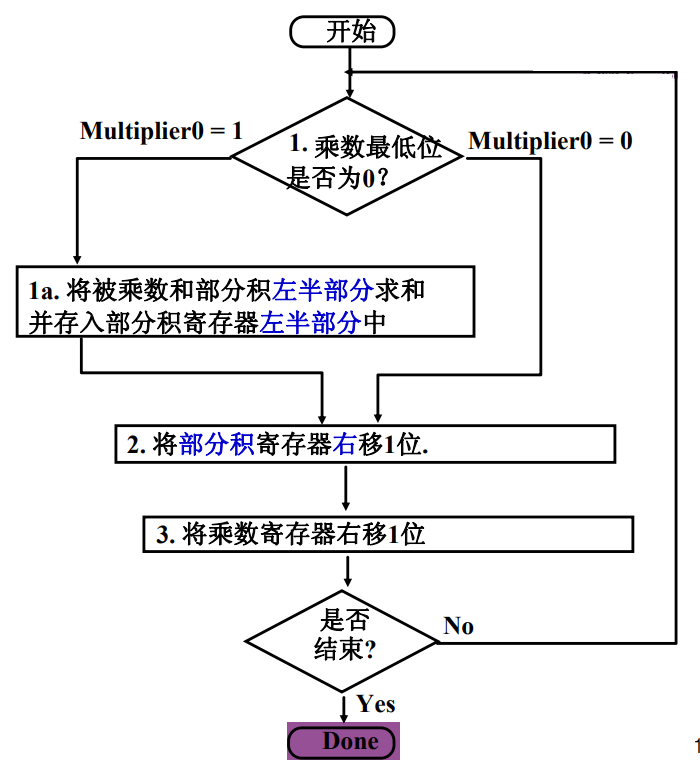

# Slides8:算术操作-2

参考资料：https://wdxtub.com/csapp/thin-csapp-1/2016/04/16/

# 原码乘法

请你计算这一原码乘法​

​

# 原码乘法运算算法及其改进

（这里不制卡！！！），看看就好

## 法一

​

​​

​

但是积和被乘数的储存空间都有浪费

## 法二

​​

​  
注意，这样只需要32位ALU和32位被乘数寄存器

# 最终方案

请问原码乘法最后怎么计算？以$1000 \times 1001$为例说明：  
我们使用如下硬件：  
如果multiplier的末位是1，我们就在product部分加一整个multiplicand，然后右移；如果...为0，就直接右移。（自己的表述）  
例子，比如$1000 \times 1001$，请打开思源笔记查询

​

​​

# 原码除法

‍

# 浮点数表示方法

Q：根据IEEE 745标准，如何表示浮点数？（以32位浮点数为例）  
$x = (−1) ^S ×(1. M)× 2^{E−127}$

​  
其中1+8+23

$$
x = (−1) ^S ×(1. M)× 2^{E−127}
$$

# 浮点数加减运算

Q：如何进行浮点数加减运算？  
其数学表达式可记作$ｘ±ｙ＝(M_x2^{(Eｘ－Eｙ) }±M_ｙ)2^{E_y}，设Eｘ<＝Ey$  
其计算步骤为：0操作数检查-对阶-尾数加减法运算-结果规格化-舍入处理-溢出检查

# 浮点数加法运算例子

​​

# 舍入处理方法

* **就近舍入**：舍⼊为最近可表示的数

  * 非中间值：0舍1⼊
  * 中间值：强迫结果为偶数，保证最低有效位为0
* 朝+∞⽅向舍⼊
* 朝-∞⽅向舍⼊
* 朝0舍入

# 浮点数溢出

浮点数溢出都有什么情况？  
​​

# 浮点数溢出判断和处理

​  

placeholder，并未理解

# 浮点数的乘法和除法运算

浮点数乘除运算的步骤是什么？  
用公式写作：  
​$ｘ×ｙ＝2(Eｘ＋Eｙ)·(Mｘ×Mｙ)$  
​$x \div y＝2(Eｘ－Eｙ)·(Mｘ÷Mｙ)$  
步骤：0操作数检查-阶码加减操作-尾数乘除操作-结果规格化-舍入处理

注：结果规格化是指小数点之类的回归到$1.xxx \times 2^n$，然后舍入处理是类似于十进制算数的四舍五入

# 浮点数乘除法中的阶码运算

阶码加法/减法公式是什么  
Ez ← Ex+Ey+129 （mod 2^8^）  
Eb ← Ex+[–Ey]补+127 （mod 2^8^）

​​

谔谔，所以这是在干啥【真的不想看了】

‍
