# sildes 9: processor

# CPU的功能和组成

## CPU的功能

CPU的功能是什么？可以分为哪四个部分  
提取指令，并对其译码，按指令对数据执⾏各种操作。具体而言，分为指令控制，操作控制，时间控制和数据加工四个部分

## CPU的三大组成部分

CPU三大组成部分是什么？  
运算器，cache，控制器

## 控制器功能概述

CPU中控制器功能是什么？  
控制指令的执行过程。具体而言分为三个部分：正确并且自动连续执行指令；能够正确并分步完成每一条指令规定的功能；能够执行程序的过程中响应并处理中断

## 计算机中指令的表示

* **指令字**​:完整的⼀条指令的⼆进制表示
* **指令字⻓**​:指令字中⼆进制代码的位数
* **指令格式**​:指令字中操作码和操作数地址的⼆进制位的分 配⽅案
* **操作码**​:指明本条指令的操作功能,每条指令有⼀个确定的 操作码
* **操作数地址**​:说明操作数存放的地址,有时是操作数本身

## MIPS指令格式

MIPS都有什么指令格式，其格式如何？  
​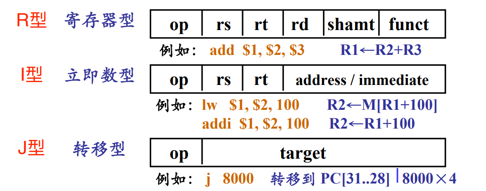​

## MIPS寻址模式

MIPS五种寻址模式是什么？  
立即数寻址，寄存器寻址，基址寻址，PC相对寻址，伪直接寻址  
​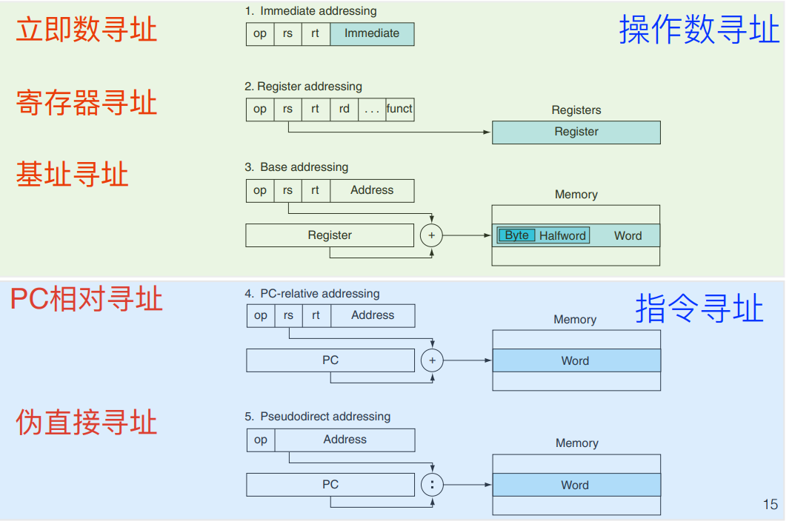

​R型指令的寻址方式只有寄存器寻址；I型指令的寻址方式有寄存器寻址、立即数寻址、基址寻址、相对寻址；J型指令的只有伪直接寻址。

# 一个基本的MIPS实现

我们在这个部分实现一个MIPS指令的子集

[MIPS攻略](https://www.cnblogs.com/Roboduster/archive/2022/04/18/16158413.html#02--%E5%AF%BB%E5%9D%80%E6%96%B9%E5%BC%8F)

## 数据通路

what is datapath？  
A datapath is a collection of functional units, as arithmetic  logic units or multipliers, that perform data processing  operations.

## 数据通路中的两类逻辑单元

* **组合单元**：输出只取决于当前的输入；当输入相同时，输出也相同
* **状态单元**：带有内部储存功能，输出还依赖于内部状态

## 取指的实现

取指令这一步如何实现？  
​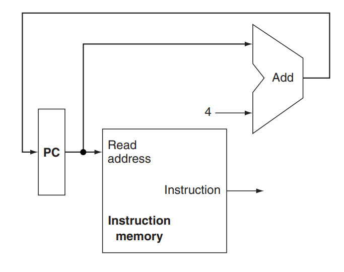​

## R型指令的数据通路

R型指令的数据通路如何实现？  
​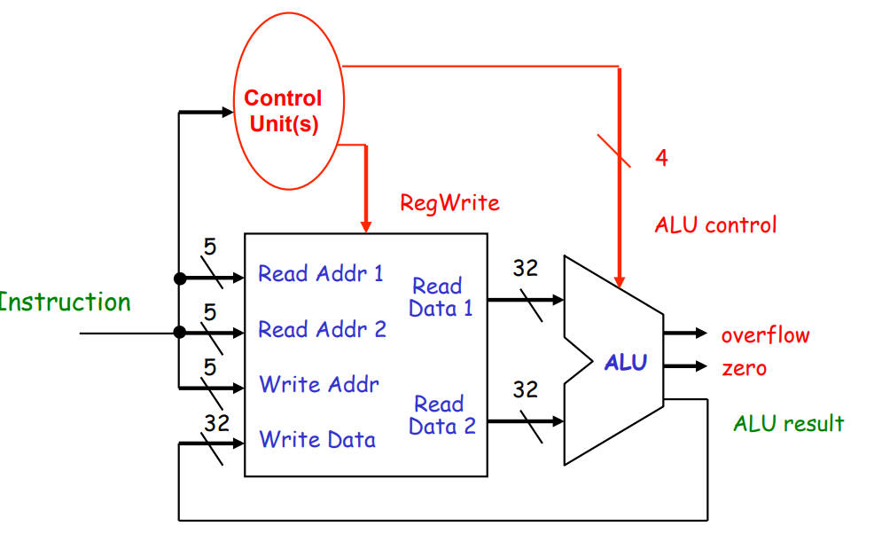​

## 存取指令的数据通路

如何在R型指令的基础上增加存取指令的数据通路？  
​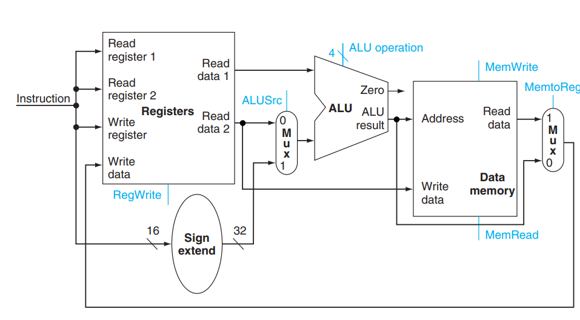​

## 存取指令的数据通路

如何在R型指令，存取指令的基础上增加分支指令的数据通路？  
​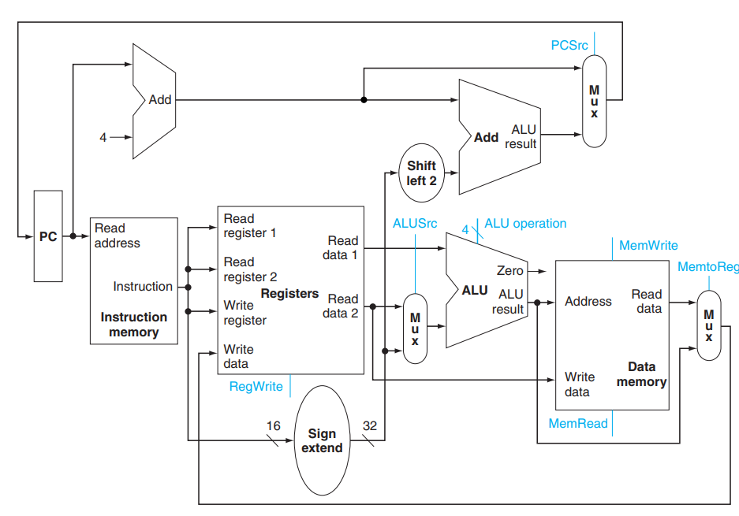​

## 存取指令的数据通路

加入控制单元之后，数据通路是什么样子的？  
​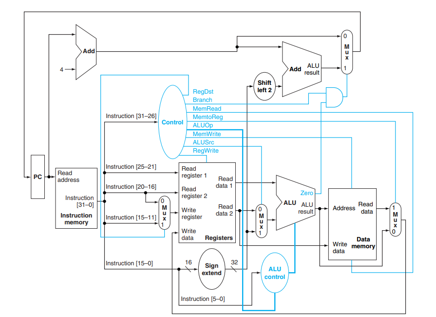​

## ALU控制单元的设计

如何设计ALU控制单元？  
根据ALUOp和R型指令funct设置ALU控制信号，（下图仅作参考）：  
​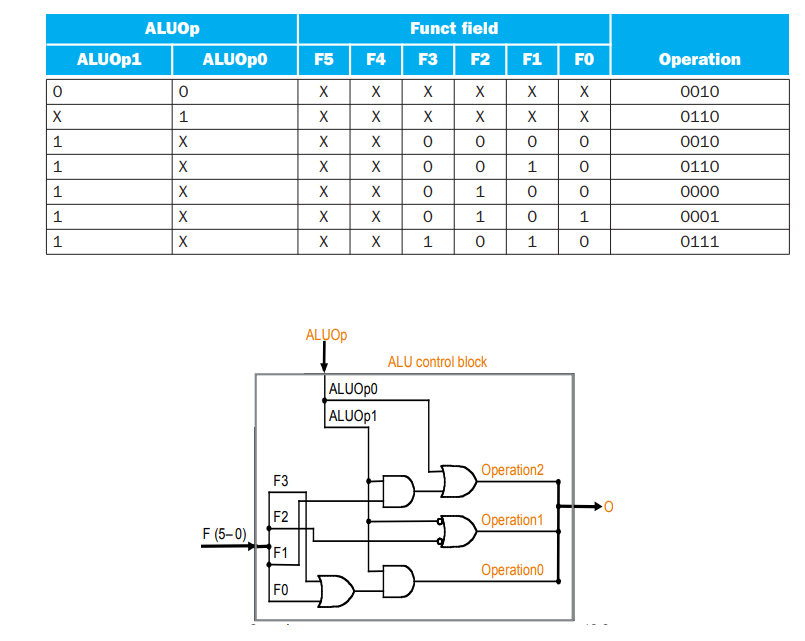​

## 主控制单元的设计

首先，让我们看一下从内存中读取的都是什么：  
​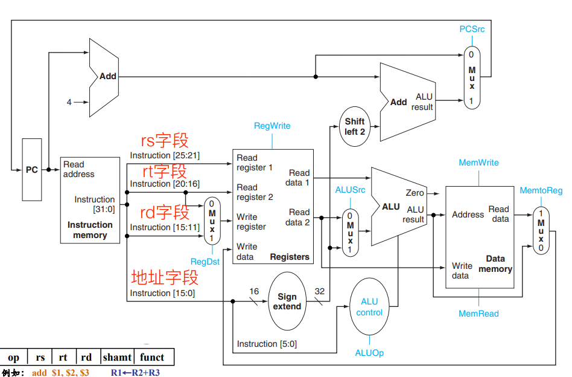​

然后，再来看一下七个控制信号的作用：

* RegDst：看看有无rd字段，从而控制数据正确的读入
* RegWrite：控制寄存器是不是可以写入
* ALUSrc：控制ALU第二个参数读取的是rt还是address
* PCSrc：控制PC到底是发生跳转，还是PC+4
* MemRead：内存可读
* MemWrite：内存可写
* MemtoReg：内存写回寄存器

接下来，让我们看一下连好之后长啥样：  
​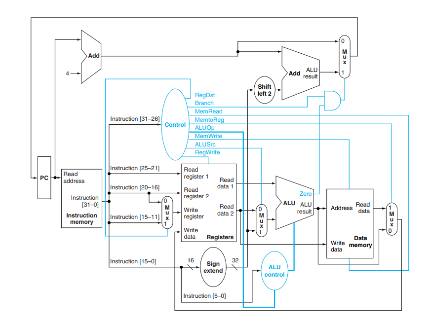​

这些控制信号都是指令码通过一系列的逻辑门解码，然后判断要输出什么控制信号：  
​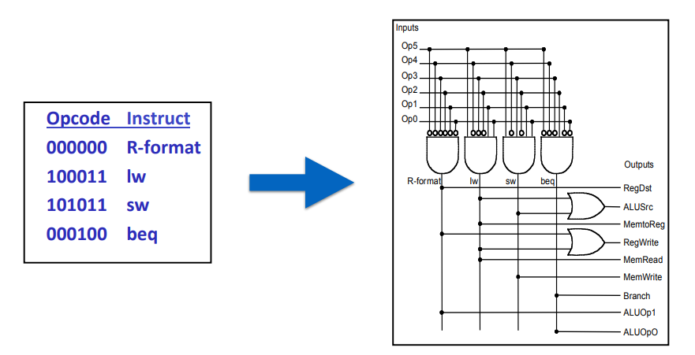​

# 数据通路的操作

## R型指令的执行

mips中如何执行形如`add $t0 $t1 $t0`​这样的指令？  
首先，我们将对应的数据传输到正确的地方：  
​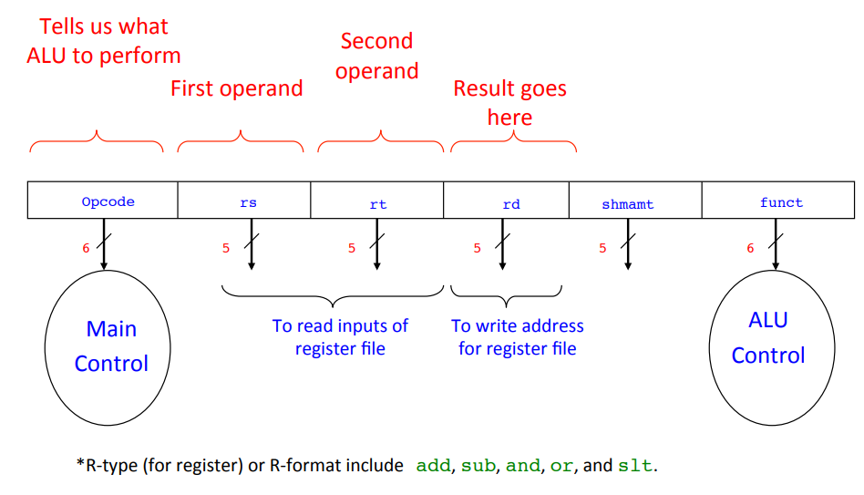接下来，我们看看数据怎么在数据通路里传输的：  
​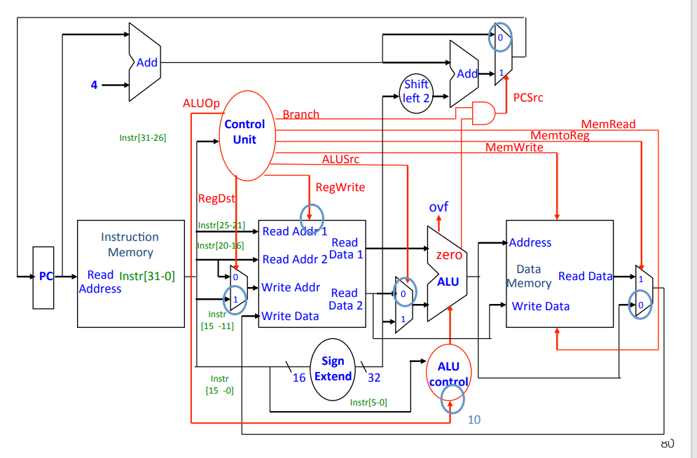​

## 执行存取指令

mips中如何执行形如`lw $t0, 1200($t1)`​​这样的指令？  
​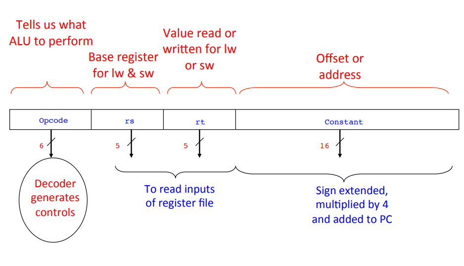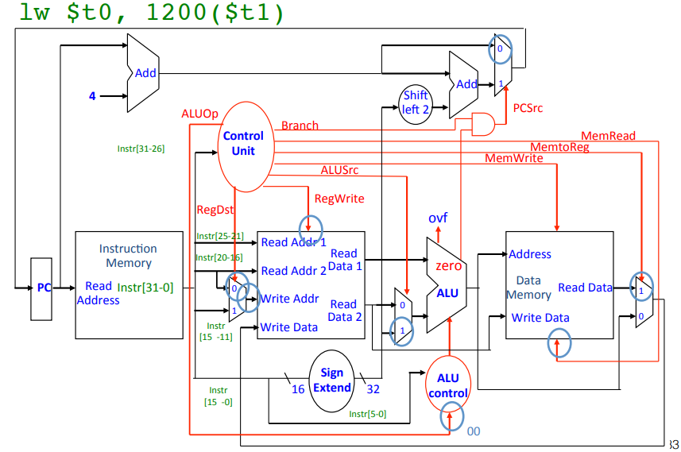​

## 执行条件分支指令

mips中如何执行形如`beq $t1, $t2, offset`​这样的指令？  
​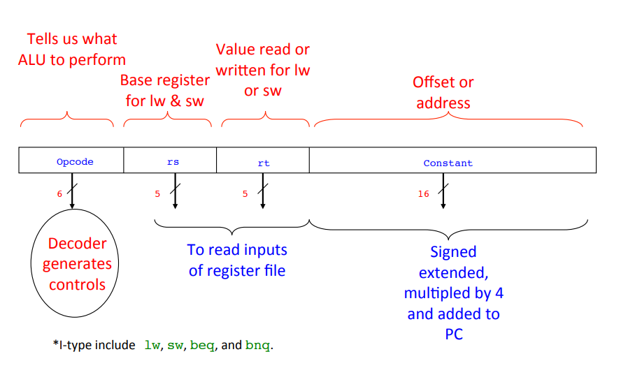​

​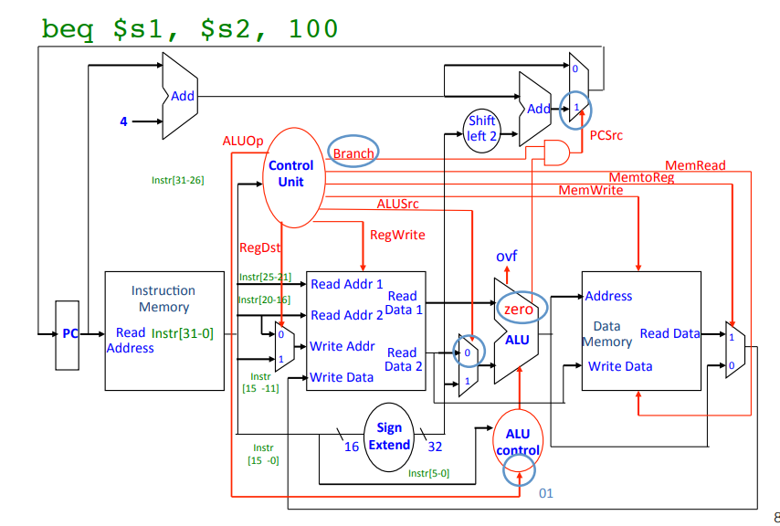​
