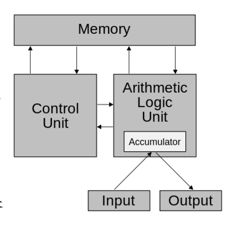

# sildes2：计算机发展简史

# 什么是计算机

什么是计算机（看看即可）？  
A calculating machine, esp. an automatic electronic device for  performing mathematic or logical operations; freq. with  defining word prefixed, as analogue, digital, electronic  computer

# 计算机的发展历程

* 早期计算工具-算盘
* 机械计算⼯具-帕斯卡计算器；步进式计算器；科塔计算器；巴贝奇差分机和分析机
* 二进制与布尔代数：18xx年发明，1938年香农提出可以用布尔代数实现开关电路
* 电动机械计算机-Z系列计算机
* 电子模拟计算机
* 电子数字计算机

# 现代计算机的组成

现代计算机如何组成？  
​​

# 冯诺伊曼计算机

冯诺依曼关于计算机组成的主要思想有什么？  
计算机硬件系统由运算器、控制器、存储器和IO设备组成；  
采用二进制编码表示数据；  
将程序和数据统一表示；  
计算机具有顺序指令的处理能力

​​
