# sildes3：计算机硬件、软件概述

计算机硬件系统由运算器、控制器、存储器和I/ O设备组成

​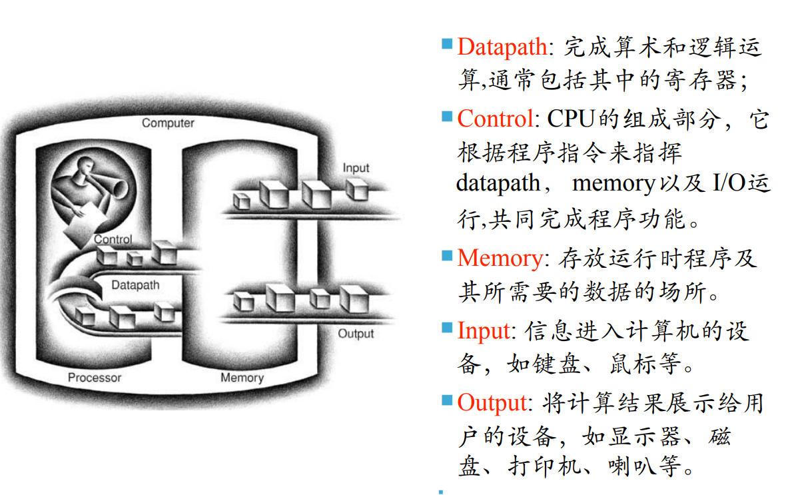

# CPU=运算器&控制器

​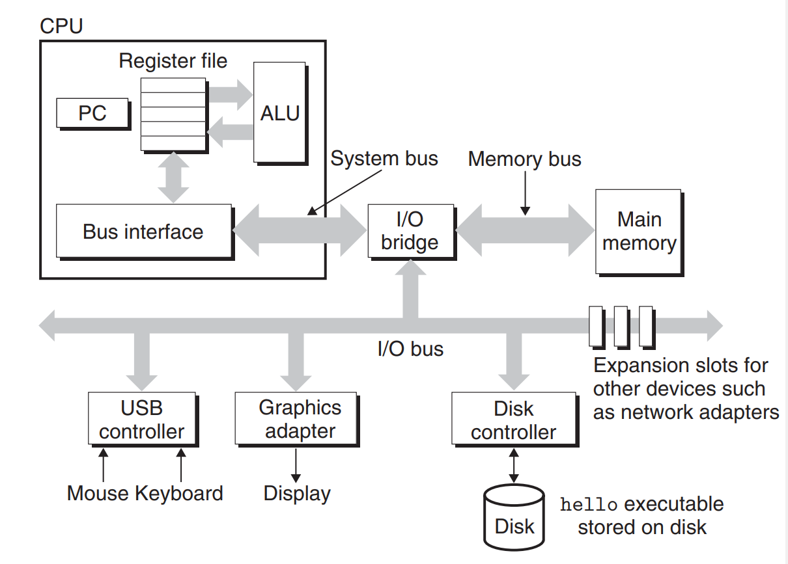​

​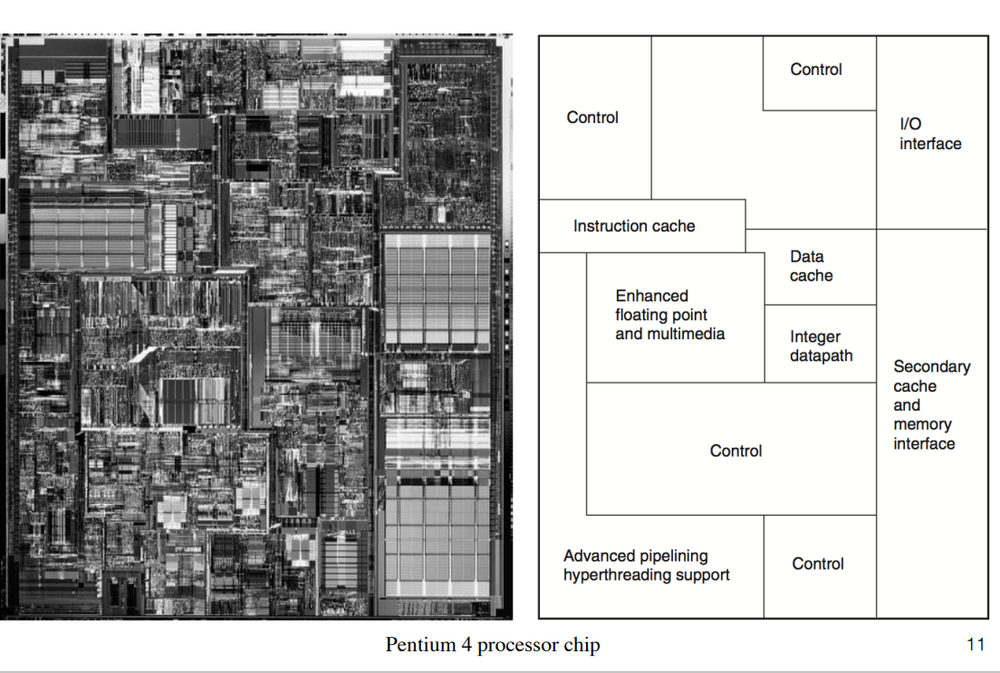

## CPU的部分及其功能

CPU由哪几个部分组成，分别都有什么功能？  
数据通路-完成算术运算  
控制器-指导数据通路，储存器，IO设备按照程序的指令正确执行  
缓存（cache）

# 储存器

## 储存器有哪些

请问储存器有哪些？  
​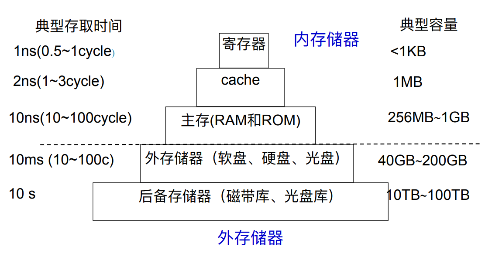​

## 内存储存器

储存器中的内存有什么？  
​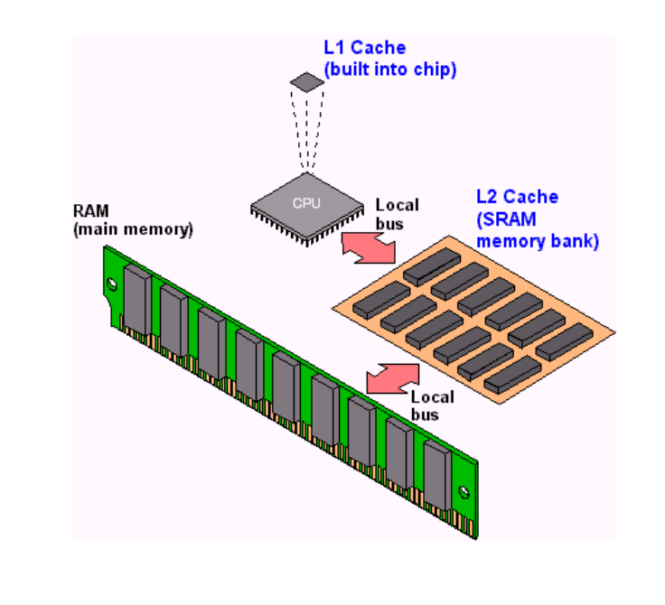​

## 主存（main memory）

请问主存是有什么组成的，其原理是什么？  
DRAM，即动态随机存取储存器。  
其基本储存单元是：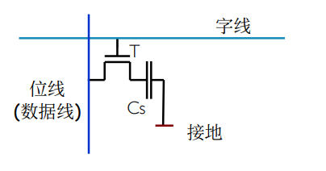  
通过电容中电荷的有无表示数据01。  
读写原理为：写“0”时，在数据线上加低电平，使CS上电荷对数据线放电； 写“1”时，在数据线上加⾼电平，使数据线对CS充电； 读出时，在数据线上有⼀读出电压。它与CS上电荷量成正⽐。

## DRAM芯片的逻辑结构

请问DRAM芯片的逻辑结构（aka主存的样子）是什么？（看看即可）  
​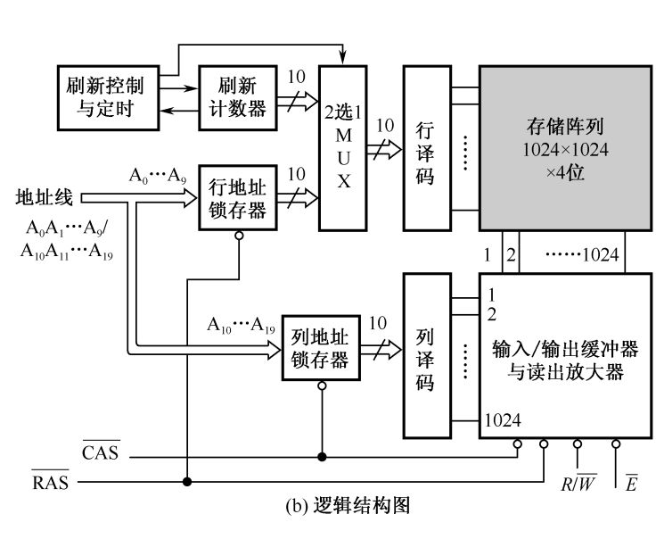​

## 磁盘的外形和结构

磁盘的外形和结构是什么？  
​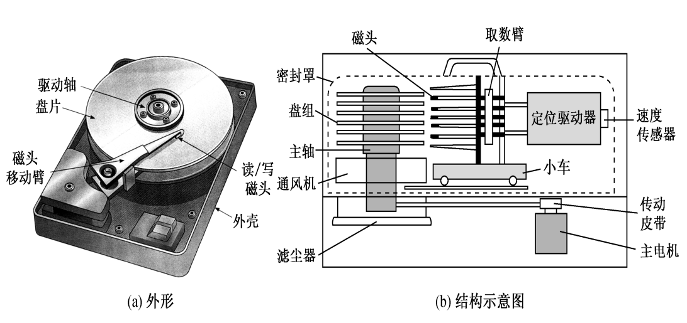​

## 磁盘读写原理

磁盘读写原理是什么？  
​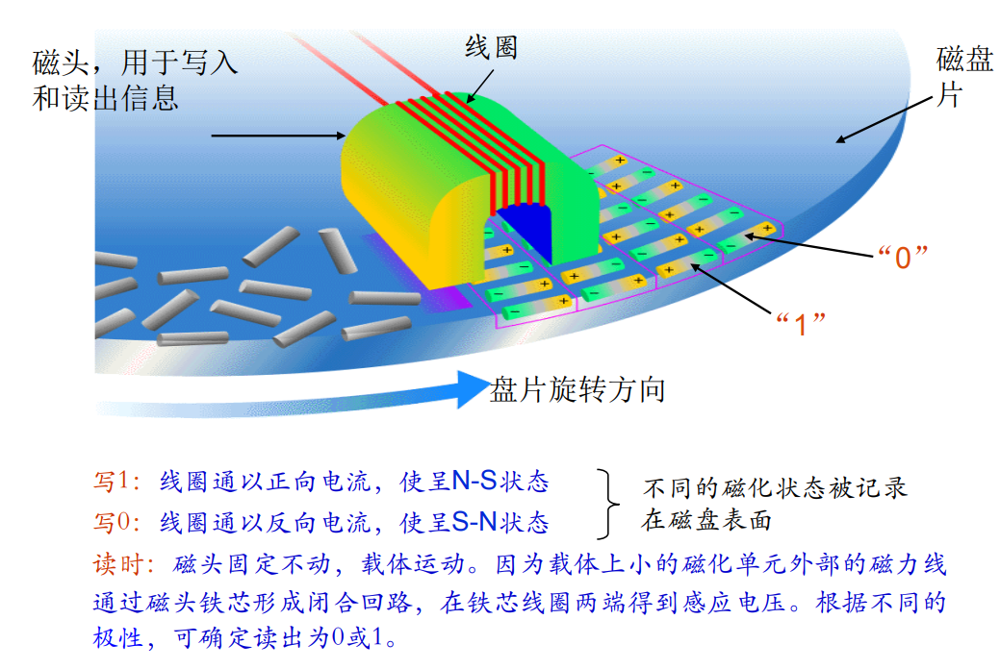

## 磁盘读写原理

磁盘的磁道和扇区是什么意思？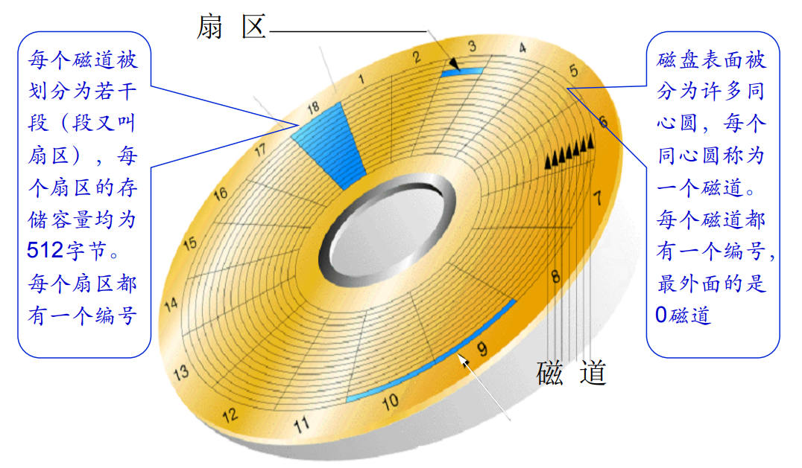​

## 闪存

闪存是什么，优点是什么？  
在EPROM存储元基础上发展起来的⾼密度⾮失易失性的读/写存 储器；既有RAM的优点，⼜有ROM的优点，称得上是存储技术划时代 的进展

## 光盘

光盘是什么，储存，读取数据的原理？  
（很显然）；  
即光盘上的信息以坑点形式分 布，有坑点表示为“1”，⽆坑点表示为“0”，⼀系列的坑点(存储元)形成信息记录道；  
读出时，当激光束聚焦点照射在凹坑上时 将发⽣衍射，反射率低；⽽聚焦点照射在凸⾯上时⼤部分光将返回。根据反射光的 光强变化并进⾏光电转换，即可读出记录信息

## 光盘扇区

光盘扇区的结构是什么样子的？（看看即可）  
​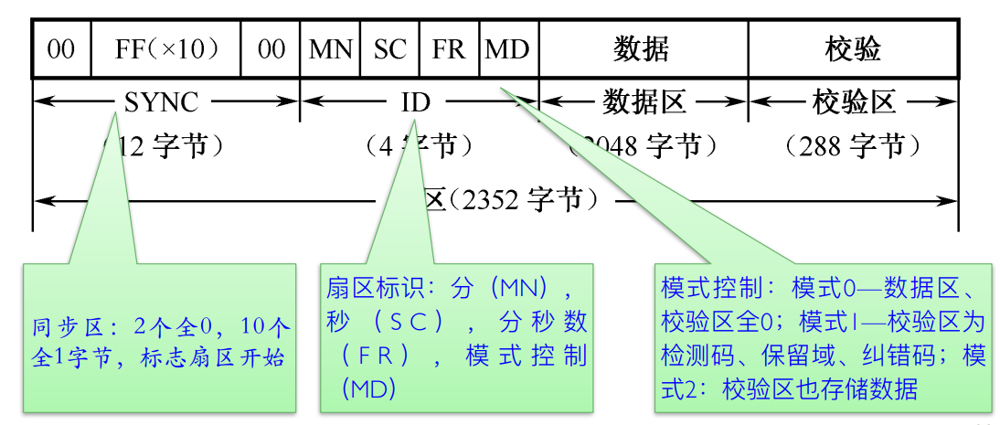​

## 磁带

磁带读写原理？  
写⼊时可通过磁头把信息代码记录在磁 带上。当记录有代码的磁带在磁头下移动时，就可在磁头线圈 上感应出电动势，即读出信息代码

# CPU性能

## 摩尔定律

什么是摩尔定律？  
当价格不变时，集成电路上可容纳的电晶体数⽬，约每隔24个⽉（现在普 遍流⾏的说法是“每18个⽉增加⼀倍”）便会增加⼀倍，性能也将提升⼀ 倍；或者说，每⼀美元所能买到的电脑性能，将每隔18个⽉翻两倍以上

## 如何评价计算机的性能

* **响应时间**:计算机完成某项任务所需要的总时间，包括硬 盘访问、内存访问、I/O活动、操纵系统开销和CPU执⾏时间 等
* **吞吐率**:也叫带宽，表示单位时间内完成的任务数量
* **相对性能**：（就是性能做除法）
* **CPU执行时间**：执⾏某⼀任务在CPU上所花费的时间
* **⽤户CPU时间**：CPU执⾏⽤户程序花费的时间
* **系统CPU时间**：操作系统为⽤户服务花费的CPU时
* **时钟周期**：
* **时钟频率**：时钟周期的倒数（见((20221111193507-ee1o4fs '时序电路01-latch and flip flop'))）

## CPU时间

CPU时间怎么计算？  
$CPU time_A =CPU clock cycles_A \div clock rate_A$

## 一些和CPU相关的物理量

1GHZ意味着在一秒钟，计算机进行了多少时钟周期？  
$10^9$

## 例题

某程序在⼀台时钟频率为2GHz的计算机A上运⾏需要10秒。现在将设计⼀台 计算机B，希望将运⾏时间缩短为6秒。计算机的设计者采⽤的⽅法是提⾼时 钟频率，但这会影响CPU其余部分的设计，使计算机B运⾏该程序时需要相 当于A 1.2倍的时钟周期数。那么计算机设计者应该将时钟频率提⾼到多少？  
​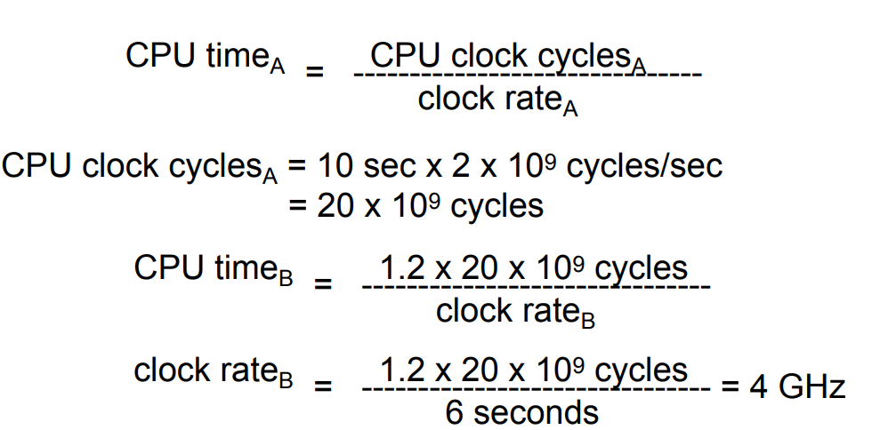​

## CPU性能及其影响因素

如何计算CPU  time for a program?  
​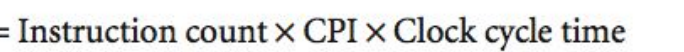  
另外，前两个值相乘，是程序的CPU时钟周期数

## 指令的性能

什么是CPI（Clock cycles per instruction）？  
the average number  of clock cycles each instruction takes to execute

## CPI例题

假设我们有相同指令集的两种不同实现⽅式。计算机A 的时钟周期为250ps，对某程序的CPI为2.0；计算机B 的时钟周期为500ps，对同样程序的CPI为1.2.对于该 程序，请问哪台计算机执⾏的速度更快？快多少？  
​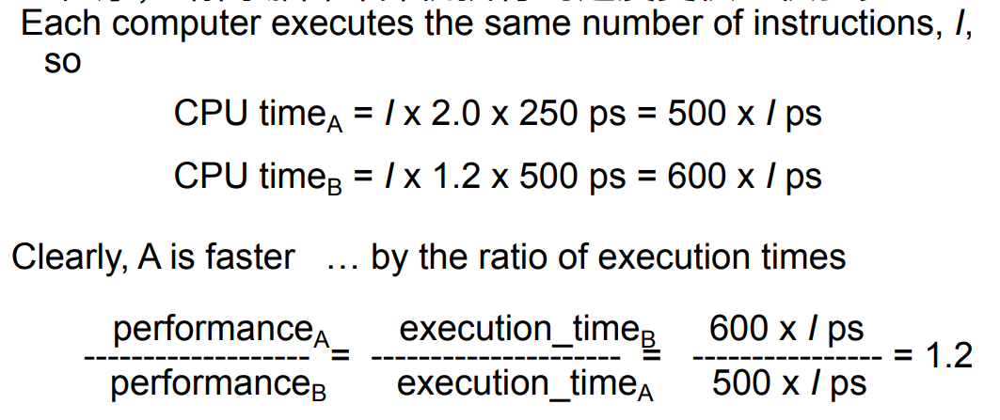​

## 综合例题

⼀个编译器设计者试图在两个代码序列之间进⾏选 择：

​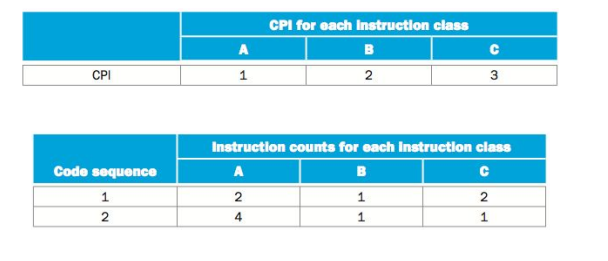​

哪个代码序列执行的指令数更多？**序列1指令数=2+1+2=5；序列2指令数=4+1+1=6**

哪个执行速度更快？**代码序列1的CPU时钟周期数=10；代码序列2的CPU时钟周期数9**

每个代码序列的CPI是多少？**第一个CPI是2.0，第二个是1.5**

## CPU性能小结

* **程序的CPU执⾏时间**：程序执⾏的秒数
* **指令数**：程序执⾏的指令数
* **CPI**：每条指令的平均时钟周期数
* **时钟周期时间**：每时钟周期的秒数

## 与程序性能相关的因素

* 算法，编程语言，编译程序-**指令数，CPI**
* 指令集体系结构-上述两个，还有**时钟频率**

## 功耗墙

什么是功耗墙？  
⽬前，处理器功耗已达到极限，⽆法再将处理器冷却下来

## 功耗墙问题的解决

现代处理器技术如何解决面临的功耗墙？  
通过降低电压来抵消频率增⻓带来的功耗增长；从单处理器向多处理器转变

## CPU的制造

​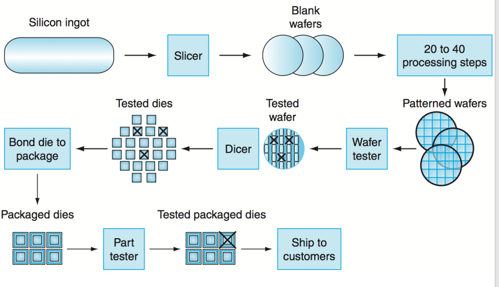​

# 计算机软件概述

## 系统软件

系统软件都有什么，有什么功能？  
操作系统：处理输入输出，分配内存外存，为多个应⽤程序提供共享计算机资源的服务  
编译程序：把⾼级语⾔编写的程序翻译为硬件能执⾏的指令

‍
