# slides12-储存器层次结构2-cache映射，影响cache命中率的因素

# cache

## 提高cache的性能

如何计算cache的平均访问时间？  
平均访问时间 =命中时间 x 命中率+失效损失 x 缺失率

### 命中率

* 在⼀个程序执⾏期间，设Nc表示cache完成存取的总次数，Nm表示主存完成存取的总次数，h定义为命中率，则有h=**Nc/(Nc+Nm)**
* 若tc表示命中时的cache访问时间，tm表示未命中时的主存访问时间，1-h表示未命中率，则cache/主存系统的平均访问时间ta为：**ta=h*tc+(1-h)tm**

### 命中率对平均访问时间的影响

* 平均访问时间ta，cache访问时间tc，主存访问时间tm，命中率h，ta=h*tc+(1-h)tm
* 例1. 若h=0.85, tc=1ns, tm=20ns，则ta为多少？**4ns**
* 例2. 若命中率h提⾼到0.95，则结果⼜如何？**2ns**
* 例3. 若命中率h为0.99呢？**1.2ns**

### cache缺失的四大原因

* **必然缺失**(Compulsory Miss)，开机或者是进程切换，⾸次访问数据块
* **容量缺失**(Capacity Miss)，活动数据集超出了Cache的⼤⼩
* **冲突缺失**(Conflict Miss)，多个内存块映射到同⼀Cache块，某⼀Cache组块已满,但空闲的Cache块在其他组
* **⽆效缺失**其他进程修改了主存数据

### 处理cache缺失的方法

处理cache缺失的方法如下：  

* 必然缺失 **预取**
* 容量缺失 **增加Cache容量,可缓解缺失现象**
* 冲突缺失 **增加Cache容量或者相联的组数**有助于缓解冲突

### 影响cache缺失率的因素

* 影响cache缺失率的因素如下：
* CACHE 的容量**⼤**，命中率⾼
* CACHE 与主存储器每次交换信息的单位量(CacheLine Size)**适中**更好
* CACHE 不同的组织⽅式，**多路组相联**更好
* CACHE 的**多级组织**可提⾼命中率
* CACHE 装满后的**替换策略**

### 块大小的权衡

* 数据块⼤意味着缺失损失的增⼤
*  若块⼤⼩相对Cache总容量来说太⼤的话，**命中率**将降低

### 关联度对cache缺失率的影响

3关联度越⾼，缺失率越**低**：

* 缺失率：**直接映射**最⾼，**全相联映射**最低
* 命中时间：**直接映射**最⼩，**全相联映射**最⼤

### ex：关联度

什么是cache映射中的关联度？  
是指相应的缓存行能够存储主存储器中多少个数据块  

### 组织方式对cache缺失率的影响

经验总结:容量为N、采⽤直接映射⽅式Cache的缺失率和容量为N/2、采⽤2路组相联映射⽅式Cache的缺失率**相当**

## cache内容装入和替换策略

### 何时需要替换策略

什么时候需要考虑cache的替换策略？  
N路相联映射和全相联映射

### cache的替换算法

* 先进先出算法(FIFO)，将**最早**调⼊Cache的字块替换出去。容易实现,开销⼩。
* 最近最少使⽤算法(LRU)，需要计算**字块的使⽤次数**,开销⼤,但平均命中率⽐FIFO要⾼。
* 最不经常⽤（LFU）
* 随机替换(RAND)
* 当某段时间集中访问的存储区超过了Cache存储容量时，命中率变得很低。极端情况下，假设地址流是1,2,3,4,1 2,3,4,1,……，⽽Cache每组只有3⾏，那么，不管是FIFO，还是LRU算法，其命中率都为0。这种现象称为**颠簸(Thrashing / PingPong)**

​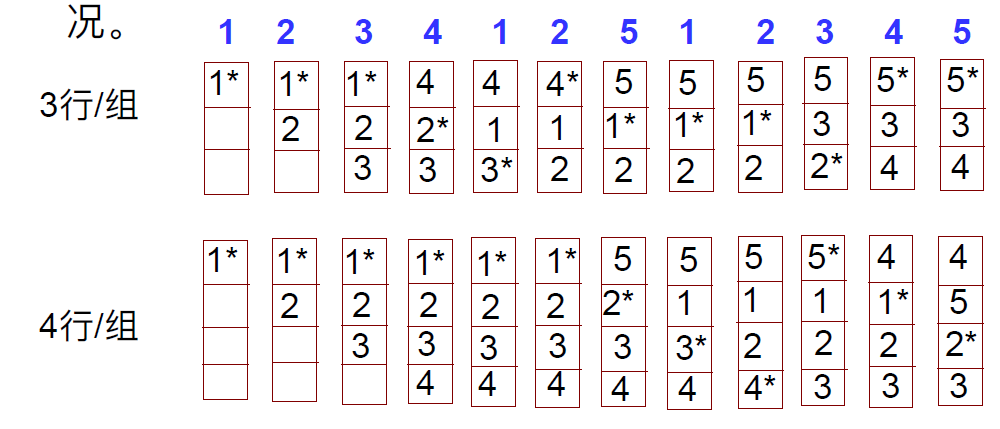​

​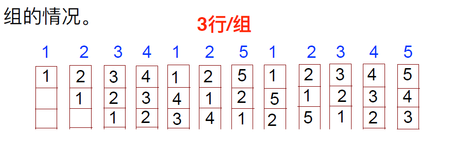​

### LRU

一些LRU的信息：

* LRU算法下的cache的命中率随组的增⼤⽽**提⾼**
* 该算法具体实现时，并不是通过移动块来实现的，⽽是通过给每个cache⾏设定⼀个**计数器**，根据计数值来记录这些主存块的使⽤情况。这个计数值称为**LRU位**。

### LRU算法实施细节

* 计数值越⼩则说明越**被常⽤**。
* 命中时，被访问⾏的计数器**置0**，⽐余计数器**加1**。
* 未命中且该组未满时，新⾏计数器置为**0**，其余全**加1**。
* 未命中且该组已满时，计数值为**3（最⼤）**的那⼀⾏中的主存块被淘汰，新⾏计数器置为0，其余加1。

### LRU vs LFU eg

设cache有1、2、3、4共4个块，a、b、c、d等为主存中的块,访问顺序⼀次如下：a、b、c、d、b、b、c、c、d、d、a ,下次若要再访问e块。问，采⽤LFU和LRU算法替换结果是不是相同？  
不同，LFU算法替换a，然而LRU算法替换b

## cache和内存的数据一致性

### 改写主储存器的策略

* 接下来直接改写主存单元内容(**Write Through/直写**)
* 拖后改写主存单元内容，需要dirty bit(**Write Back/写回**)

### miss处理

* 和直写对应的miss处理是**Non-write-allocate**
* 和写回对应的miss处理时**write-allocate**

### 直写中的write buffer

* 在 Cache 和 Memory之间加⼀个Write Buffer  
  ▪ CPU: 同时写数据到**Cache和Write Buffer**  
  ▪ **Memory controller（存控）**: 将缓冲内容写主存
* Write buffer (写缓冲) 是⼀个**FIFO队列**  
  ▪ ⼀般有4项  
  ▪ 在存数频率<<DRAM写（周期）频率情况下，效果好
* 最棘⼿的问题  
  ▪ Store frequency > 1 / DRAM write cycle(频繁写)时，使Write buffer **饱和(溢出)，会发⽣阻塞**
* 如何解决写缓冲饱和？**加⼀个⼆级Cache**；使⽤Write Back⽅式的Cache

​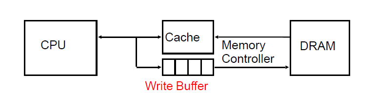​

### 多级cache

* 采⽤两级或更多级cache来提⾼命中率  
  ▪ 增加Cache层次  
  ▪ 减少访存次数，当L1未命中时，可以从L2中获取信息
* 将Cache分解为**指令Cache和数据Cache**  
  ▪ 指令流⽔的现实要求  
  ▪ 根据具体情况,选⽤不同的组织⽅式、容量

> 分⽴Cache特别适⽤于如Pentium和PowerPC的超标量机器中。这些机器采⽤指令并⾏执⾏和指令预取技术。这样，减少了在指令译码处理和指令执⾏阶段对Cache的竟争。流⽔线⽅式下这点尤为重要。

​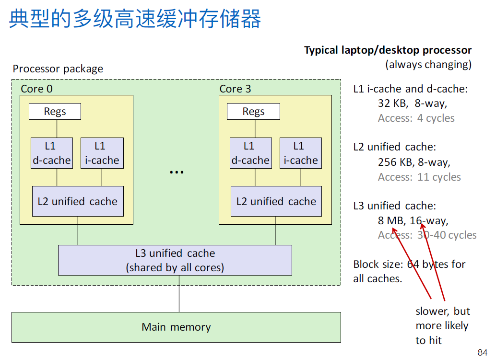​

### 多级cache-性能计算

某处理器在⽆cache缺失时CPI为1，时钟频率为5GHz。假定访问⼀次主存的时间（包括所有的缺失处理）为100ns，平均每条指令在L1 Cache中的缺失率为2%。若增加⼀个L2Cache，其访问时间为5ns，⽽且容量⾜够⼤到使全局缺失率减为0.5%，问处理器执⾏指令的速度提⾼了多少？  
如果只有一级cache，缺失损失为$100ns \times 5GHZ=500 cycle$，$CPI=1+500\times 0.02 =11$  
如果有两级cache，存在两种缺失，L1缺失$5ns\times 5GHZ = 25 cycle$，L1和L2都缺失：500时钟，$CPI=1+25\times 0.02 + 500 \times 0.005 = 4$  

==（为什么用时钟周期而不用秒数）==

具体计算见这里：测量memory access[^1]

## 程序设计时如何利用cache

​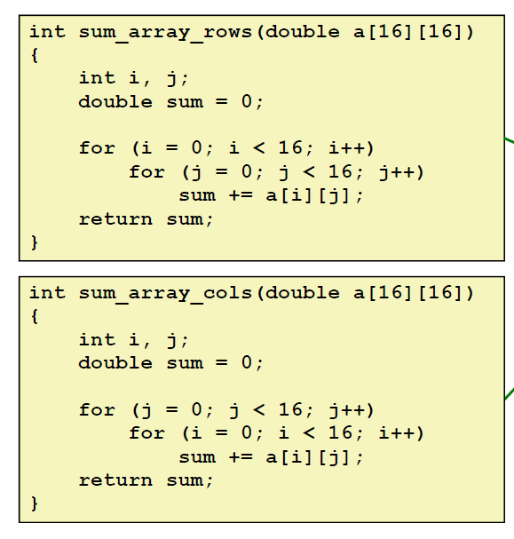  
前者更好

## cache接入系统的体系结构

### 侧接法

* **侧接法**:像输⼊输出设备似的连接到总线上
* 优点是**结构简单,成本低**,
* 缺点是**不利于降低总线占⽤率**

### 隔断法

* **隔断法**：把原来的总线打断为两段，使CACHE处在两段之间
* 优点：是有利于提高总线利用率，支持总线**并发操作**
* 缺点：是**结构复杂成本较高**

​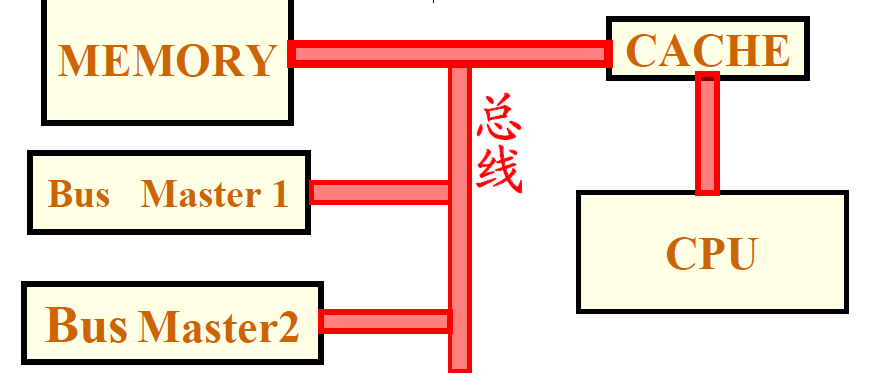​

# 虚拟储存器

## 储存器管理

在多道程序系统中，存储器的“⽤户”部分须进⼀步划分以适应多个进程。  

划分的任务由OS动态执⾏，这被称为**存储器管理(memory management)**

## 三个基本抽象

操作系统通过三个基本的抽象概念（进程、虚拟存储器、⽂件）实现硬件资源管理：

* **⽂件（files）**是对I/O设备的抽象
* **虚拟存储器（Virtual Memory）**是对主存和磁盘I/O的抽象
* **进程（processes）**是对处理器、主存和I/O设备的抽象

## 进程

* ⼀个系统可同时运⾏很多进程，但每个进程都好像⾃⼰独占使⽤系统
* 实际上，操作系统让处理器交替执⾏很多进程中的指令
* 操作系统实现交替指令执⾏的机制称为“**上下⽂切换（context switching）**”
* 进程的上下⽂

  * 指进程运⾏所需的**所有状态信息**，例如：PC、寄存器堆的当前值、cache内容、段/⻚表等
  * 系统中有**⼀套状态单元**，⽤以存放当前运⾏进程的上下⽂
* 上下⽂切换指把正在运⾏的进程换下，换⼀个新进程到处理器执⾏，上下⽂切换时，必须**保存换下进程的上下⽂，恢复换上进程的上下⽂**

​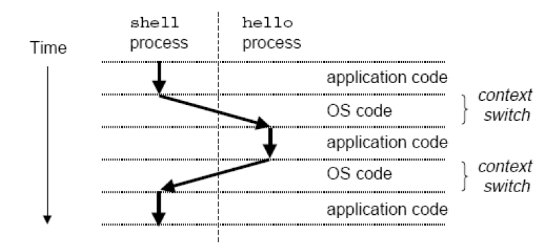​

## 使系统中尽量多地储存用户程序的解决办法

* 扩大主存
* 采⽤交换(Exchange)⽅式和覆盖(Overlap)技术

  * 分区(Partitioning)和分⻚(Paging)是**交换**的两种实现⽅式
  * 存储器中⽆处于就绪状态的进程（例如：某⼀时刻所有进程都在等待I/O）时，处理器将⼀些进程调出写回到磁盘，然后OS再调⼊其他进程执⾏，或新的作业直接覆盖⽼作业的存储区
  * 缺点：对程序员不透明、空间利⽤率差
* 虚拟存储器(Virtual Memory)

内存覆盖和内存交换：https://blog.csdn.net/dongyanxia1000/article/details/51425141

### 简单分区

* **简单分区**：主存分配：操作系统（固定）+⽤户区（分区）；
* 使⽤**⻓度不等的固定⻓分区(fixed-sizepartition)**。当⼀个进程调⼊主存时，分配给它⼀个能容纳它的最⼩的分区。
* 固定长度，浪费主存空间

### 可变长度分区

* **可变⻓分区**：分配的分区⼤⼩与进程所需⼤⼩⼀样。
* 特点：开始较好，但到最后在存储器中会有许多⼩空块出现。时间越⻓，**存储器中的碎⽚**就会越来越多

### 分页

基本思想：**内存**被分成固定⻓且⽐较⼩的存储块（⻚框、实⻚、物理⻚）；**每个进程**也被划分成固定⻓的程序块（⻚、虚⻚、逻辑⻚）程序块可装到存储器中可⽤的存储块中；⽆需⽤连续⻚框来存放⼀个进程；操作系统为每个进程⽣成⼀个**⻚表**；通过其实现**逻辑地址向物理地址转换（Address Mapping ）**

### 逻辑地址和物理地址

* **逻辑地址（Logical Address）**：程序中的指令所⽤的地址，也称为虚拟地址
* **物理地址（physical或Memory Address）**：存放指令或数据的实际内存地址，也称为实地址、主存地址

### 虚拟储存器

* 提供⼀种容量⾮常⼤的存储器：多个任务所需存储器的总和**⼤于**实际存储器空间；单个程序的地址空间超过了实际存储器
* 使得珍贵的物理存储器得到更好地利⽤
* 简化对存储的管理

### 虚拟储存器的基本概念

* 虚拟存储技术的实质  
  ▪ 程序员在⽐实际主存空间⼤得多的逻辑地址空间中编写程序  
  ▪ 程序执⾏时，把**当前需要的程序段和相应的数据块调⼊主存，其他暂不⽤的部分存放在磁盘上**  
  ▪ 指令执⾏时，通过硬件将逻辑地址（也称虚拟地址或虚地址）转化为物理地址（也称主存地址或实地址）  
  ▪ 在发⽣程序或数据访问失效时，由操作系统进⾏主存和磁盘之间的信息交换
* 虚拟存储器机制由**硬件与操作系统**共同协作实现，涉及到操作系统中的许多概念，如进程、进程的上下⽂切换、存储器分配、虚拟地址空间、缺⻚处理等。

​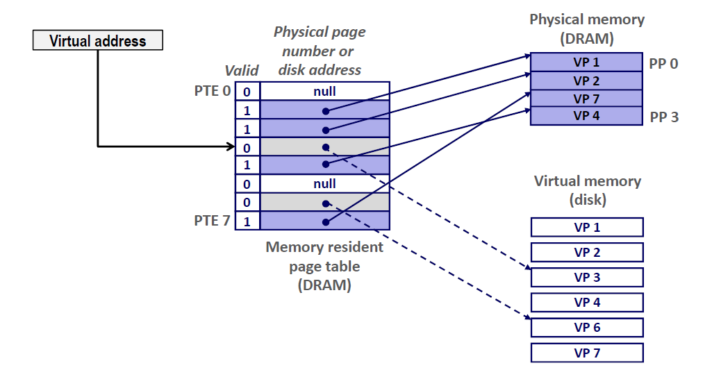​

### 页命中和缺页

* **页命中**：需要访问的虚地址中的字在主存中（有效位为1）
* **缺页**：需要访问的虚地址中的字在不主存中（有效位为0）

  * 发⽣缺⻚后，操作系统将获得控制权（**异常**机制），其在下⼀级存储层次（通常是磁盘）中找到该⻚，然后将请求⻚放到主存的某个位置

​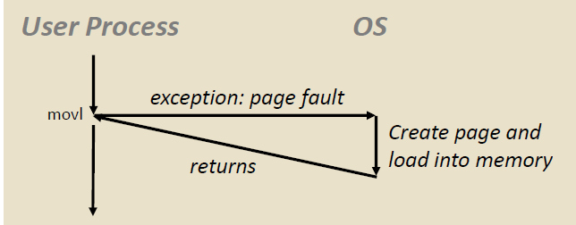​

### 页面替换算法

**最近最少使⽤(LRU)**：将⻚帧按照最近最多使⽤到最近最少使⽤进⾏排序,再次访  
问⼀个⻚帧时,将该⻚帧移到表头,替换时将表尾的⻚帧换出

### 页命中时的数据读取过程

页命中时读取数据的过程是什么？  
(1)CPU向MMU发送虚拟地址  
(2-3)MMU从⻚表中获取⻚表项  
(4)MMU向主存或cache发送物理地址  
(5)主存或cache向CPU发送数据字

​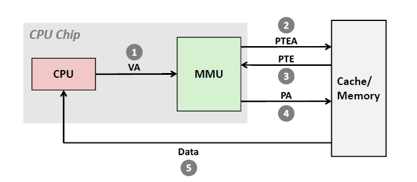

注：MMU，内存管理单元

### 缺页时的数据读取过程

缺页时读取数据的过程是什么？  
(1)CPU向MMU发送虚拟地址  
(2-3)MMU从⻚表中获取⻚表项  
(4)有效位为0，MMU触发缺⻚异常  
(5)选择被替换的⻚  
(6)在主存中插⼊新的⻚  
(7)返回原来的进程，重新执⾏刚才发⽣异常的操作

​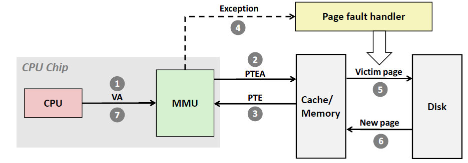​

### 地址转换的效率问题

* 由于⻚表存放在主存中，因此程序每次访存⾄少需要两次：**⼀次访存获取物理地址第⼆次访存获取数据**
* 提⾼地址转换速度的⽅法  
  ▪ 利⽤⻚表的访问局部性，即当⼀个转换的虚拟⻚号被使⽤时，它可能在不久的将来再次被使⽤；  
  ▪ 解决⽅案：转换旁路缓冲TLB  
  ▪ 包含在处理器中的**⼀个特殊的cache，⽤以追踪最近使⽤过的地址变换**

### TLB

TLB需要**速度第一，在这个基础上尽量减少缺失**

含TLB的访问内存

​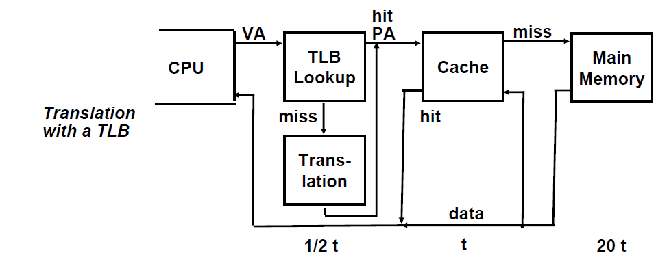​

## 段式 vs 页式储存管理

段式储存管理认为：段是共享和保护的最小单元，其中段长度**可变**，起点终点不定，这样和程序数据自然的分解正好对应，但容易产生碎片，通过段表进行管理

⻚式存储管理：将主存和虚拟内存划分为**固定大小的页**，以⻚为单位进⾏管理和数据交换，虚地址=虚⻚号+⻚内地址，实地址=实⻚号+⻚内地址，通过⻚表进⾏管理

## 页面大小的选择

* 页面小：减少**内部碎⽚**，但是需要**更大页表**
* 目前的趋势是增大**页面大小**，因为RAM价格下降，内存外存性能差距增大
* 目前页面大小为**4k**左右

[^1]: ## 测量memory access

    平均内存访问时间(AMAT)=hit time+miss rate*miss penalty

    使用：如何提高amat，coder如何使代码表现的更好

    ### hit time

    * cache size --, hit time --
    * associativity increase, hit time increase: 原因是索引index更复杂

    ### miss rate

    * program access parttern：当你遍历数组的时候，missrate低，当你从数组随机读取
    * block/cache size ,type：更大的block，cache，更多的associativity（set更大？）可以保存更多的数据，让missrate更低
    * 减少cache misses：3C：

      * Compulsory。第一次读取这个block，面临一个强制的miss——增加block size，但是不能太大
      * Capacity。cache不够大，不能保存所有的东西——增加cache size
      * Conflict/Collision。映射的位置冲突，必须取消一个——增加associativity

    3C决策树​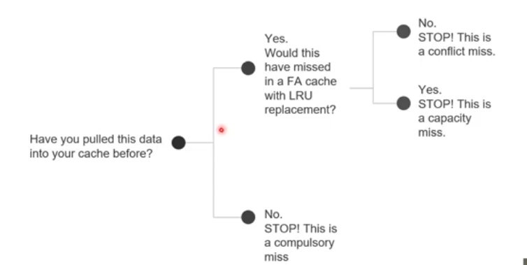​

    ### miss penalty

    讨论miss惩罚，要考虑内存结构：

    * 内存层次的结构越多，mp++
    * 块大小--，mp--
