# slides5

# 计算机指令

MIPS 32位计算机特点：32寄存器+2^30^存储字长

​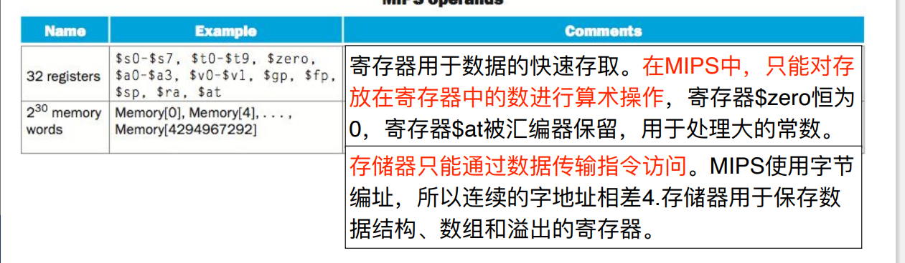​

不同的操作发生在不同的地方，比如：

​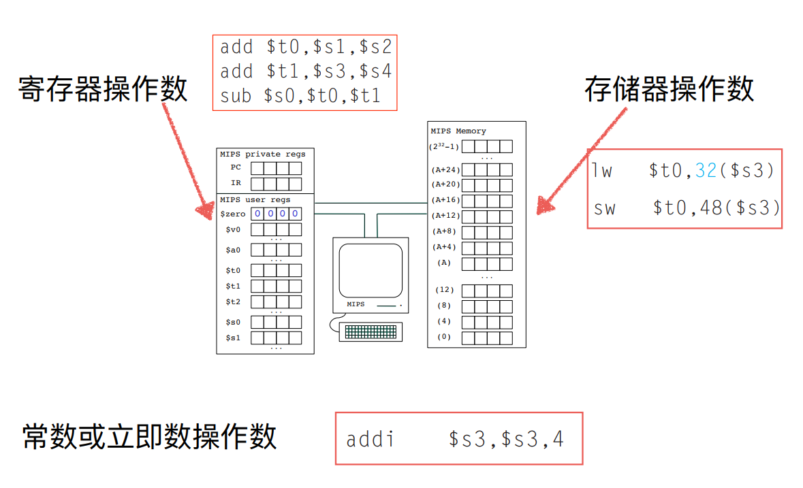lw和sw应该是将储存器读入寄存器罢

## 寄存器操作数

​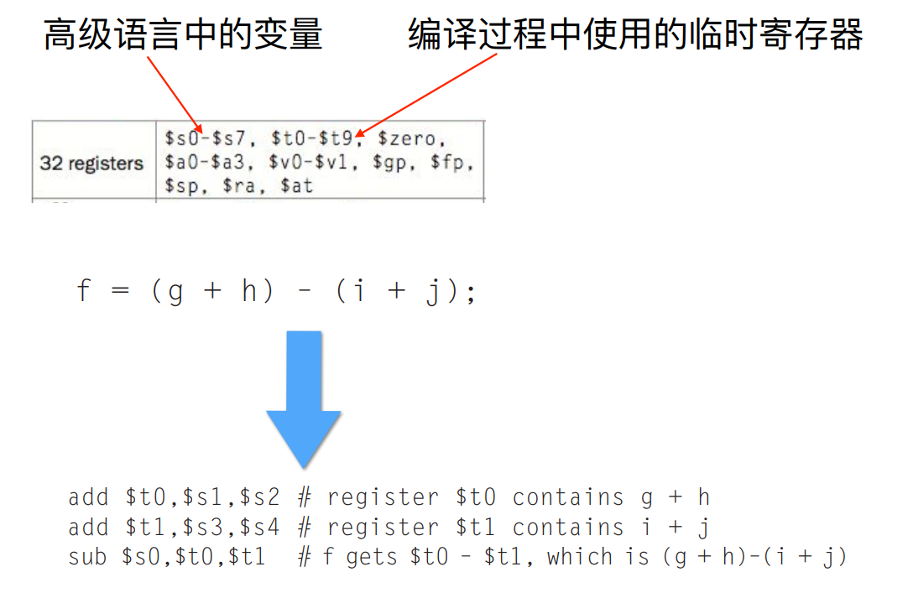

## 储存器操作数

​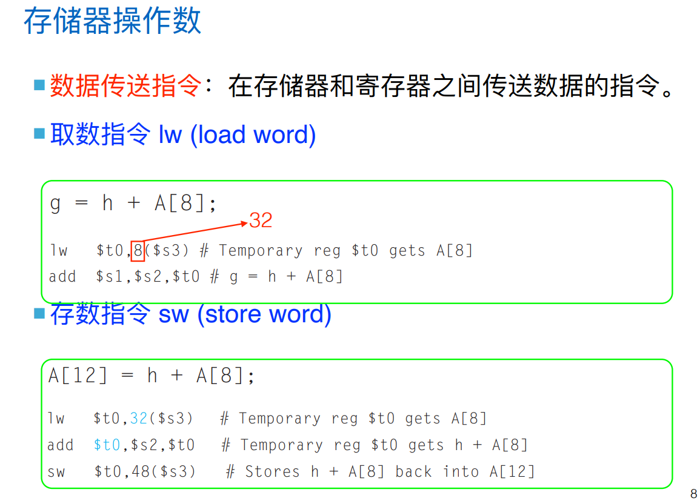​

这个取数指令和`$s3`​的关系是什么？

## 常数或立即操作

​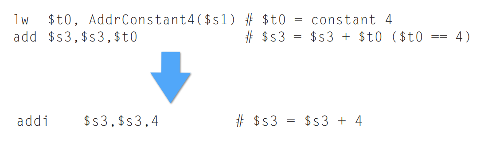​

## 指令格式

* R型-**寄存器型**
* I型-**立即数型**
* J型-**转移型**

## 逻辑操作

MIPS指令集中的逻辑操作是什么，大概有哪几类？  
对字中若⼲位或单个位进⾏操作  
​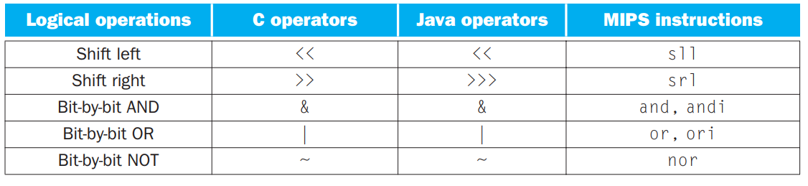​

Note：逻辑左移i位相当于乘以2^i^

eg

```mipsasm
sll $t2,$s0,4 #reg t2 = reg s0 << 4bits，左移
and $t0,$t1,$t2 # reg $t0 = reg $t1 & reg $t2
or $t0,$t1,$t2 # reg $t0 = reg $t1 | reg $t2
```

## 决策指令

MIPS指令集中的决策指令是什么，大概有哪几类？  
根据输⼊和计算过程中产⽣的值，执⾏不同的指令。有条件分支；（如果相等则`be`​，如果不相等则`bne`​，小于则这三种`slt`​,`slti`​）

### 条件分支

```mipsasm
beq register1, register2, L1 #如果相等则
bne register1, register2, L1 #如果不相等则
```

### if-else-then

​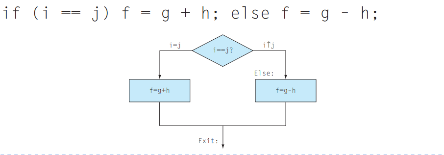​

```mipsasm
bne $s3,$s4,Else#g0t0 Else if i≠j
add $s0,$s1,$s2#f=g+h(skipped if i≠j)
j Exit#go to Exit
Else:sub $s0,$s1,$s2 #f=g -h (skipped if i j)
Exit:
```

### while

```c
while(save[i] == k)
	i+=l;
```

```mipsasm
Loop:sll $t1,$s3,2 #Temp reg$t1=4*i
add $t1,$t1,$s6#$t1 address of save[i]
1w $t0,0($t1)#Temp reg$t0=save[i]
bne $t0,$s5,Exit#go to Exit if save[i]≠k
add $s3,$s3,1 #i=i+1
	j Loop #g0t0Loop
Exit:
```

### 小于则

```mipsasm
slt $t0, $s3, $s4 #当寄存器$s3的值⼩于寄存器$s4的值时，寄存器$t0被置
                  #1，否则置0
```

### 决策和跳转指令

​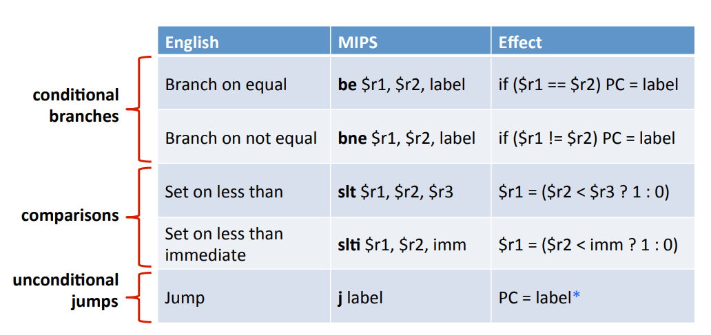​

# MIPS对计算机过程的支持

​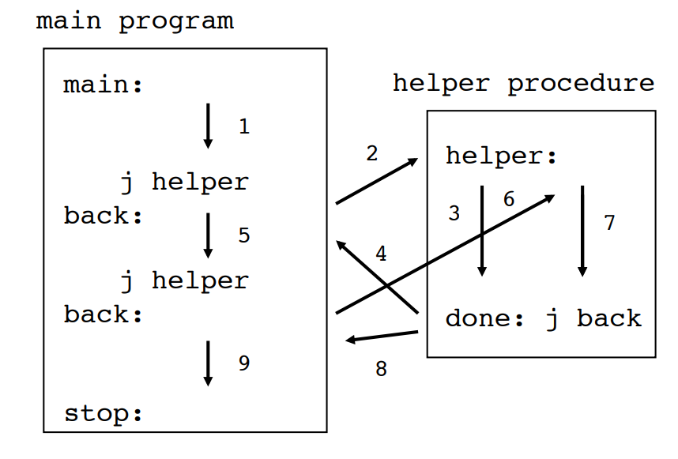​

​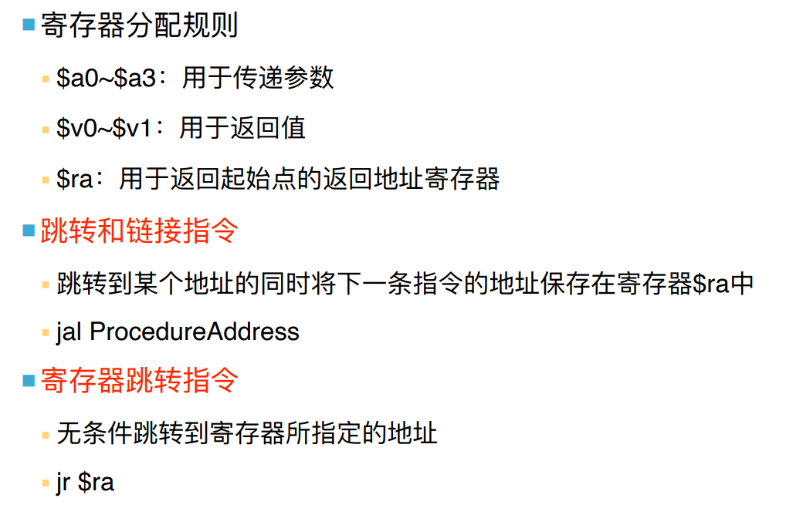​

pc和ra两个寄存器会帮助函数的调用？——这里留空，暂时看不懂

## MIPS指令集和计算机过程

如何在汇编语言的层面实现函数？  
首先，我们有寄存器的分配规则，规定一些寄存器用来传参，用来储存返回值，用来储存返回地址  
其次，我们有跳转指令`jal`​和`jr`​  
​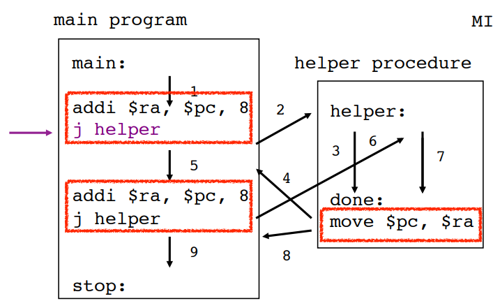​

## MIPS调用规则

* ⽤于传递参数：`$a0~$a3`​
* ⽤于返回值:`$v0~$v1`​
* ⽤于返回起始点的返回地址寄存器:`$ra`​

## 过程

​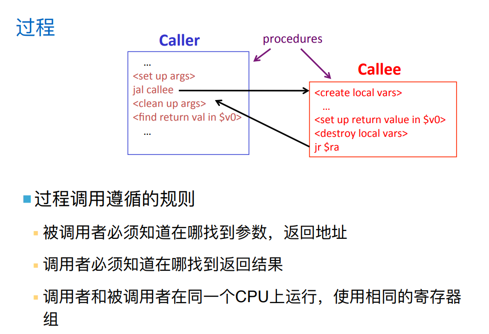​

# 主存

## 内存分配

我们如何管理主存？从大端到小端是什么样的结构  
使用栈，自上而下为：stack，heap，static data，literals，instructions  
​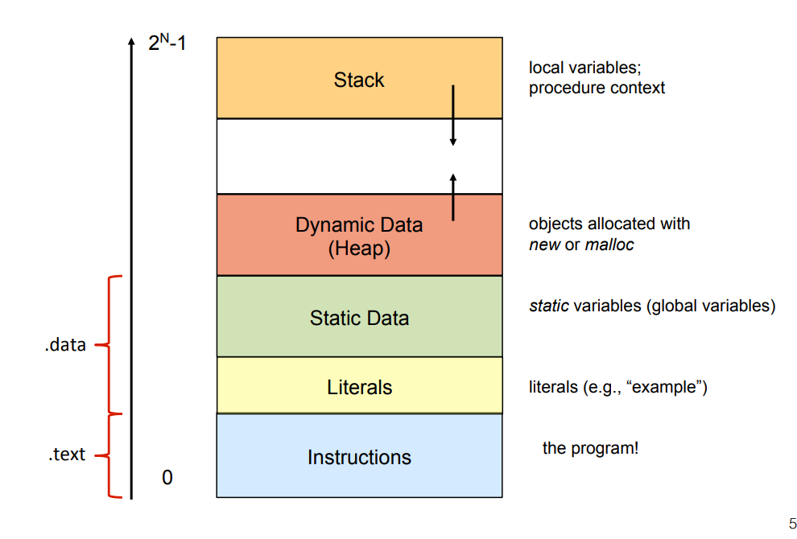​

## 栈指针

栈指针如何管理内存？  
通过指向内存的底部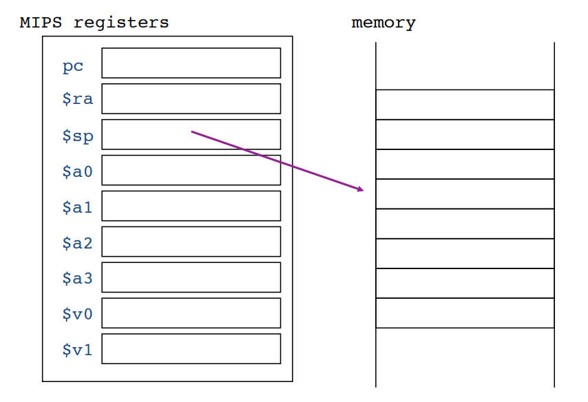​

# MIPS指令寻址方式

## 寻址方式

寻址⽅式是什么？  
指的是确定本条指令的操作数地址及下⼀条要 执⾏的指令地址的⽅法。

## 形式地址和实际地址

* 在指令中给出的操作数(或指令)的地址被称为**形式地址**
* 使⽤形式地址信息并按⼀定规则计算出来或读操作得到的⼀个数值才 是数据(或指令)的**实际地址**

## 寻址方式

​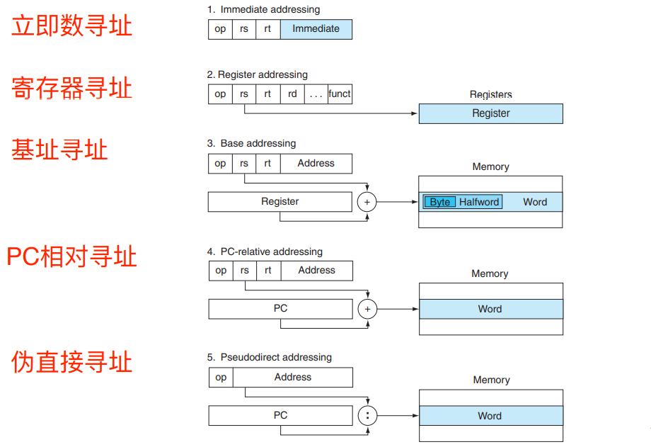

这三者是**操作数寻址**

* **⽴即数寻址**：操作数是位于指令⾃身中的常数
* **寄存器寻址**：操作数是寄存器
* **基址和偏移寻址**：操作数在内存，其地址是指令中基 址寄存器和常数的和

  * 读取32位立即数：用`or`​运算`lui`​和`ori`​的结果，16+16

后续的是**指令寻址**，比如分支和跳转中的寻址，J型，I型（分支寻址）

* **PC相对寻址**：地址是PC和指令⾃身中数的和
* **伪直接寻址**：跳转地址是指令中26位字段和PC⾼位相 连⽽成（左移2位与PC⾼4位相连）

地址都是字地址

## 各种寻址的例子

* 立即数寻址：**addi**
* 寄存器寻址：**add**
* 基址寻址：**lw**
* pc相对寻址：**分支指令和跳转到label**
* 伪直接寻址：**j**

## MIPS中32位立即数

在I型指令中，我们只能表示16位长的立即数，如何读取更大的立即数？  
通过读取⽴即数⾼位指令lui(load upper immediate)指令：  
​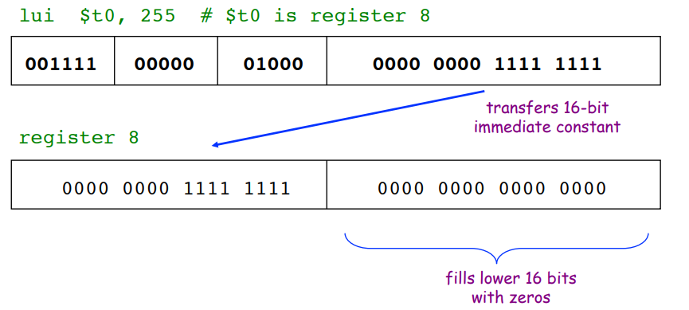​

## 分支和跳转中的寻址

在I型指令中，地址字段16位，意味着我们的程序不能大于**2**​**^16^**  字节

## PC相对寻址的计算细节

怎么计算PC相对寻址的最终地址？  
Address左移两位与PC相加
